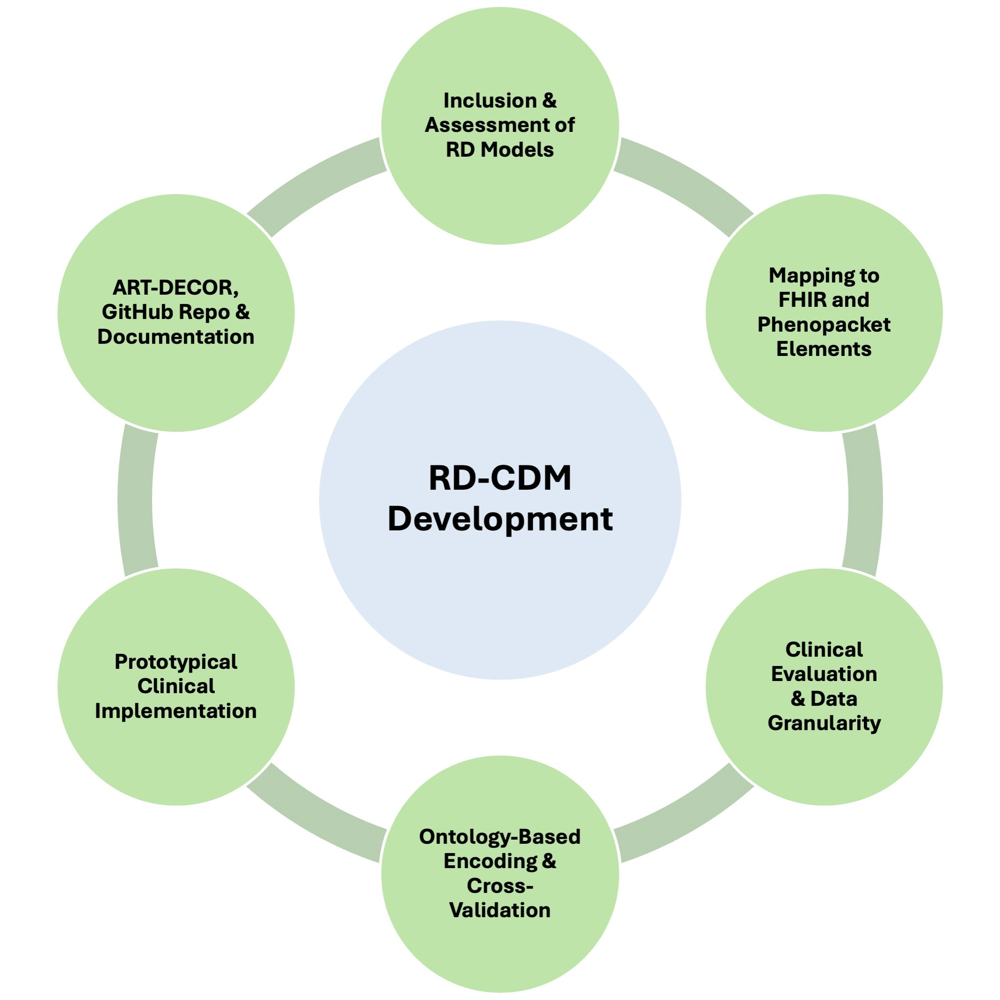
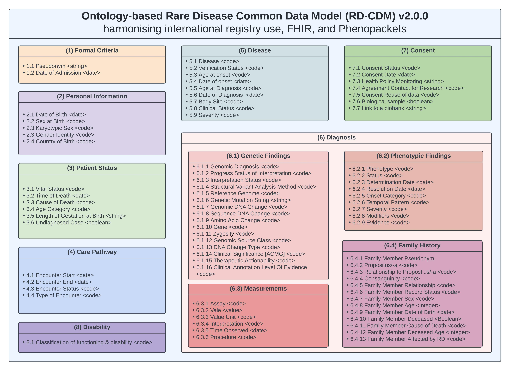
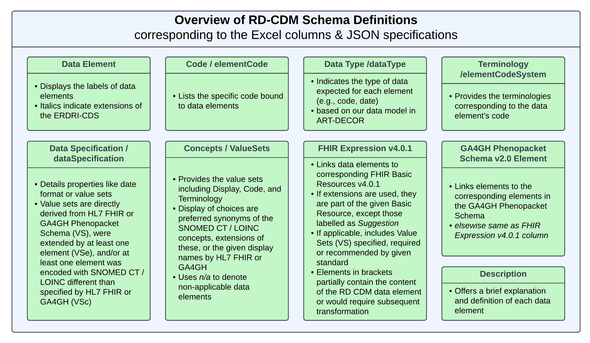
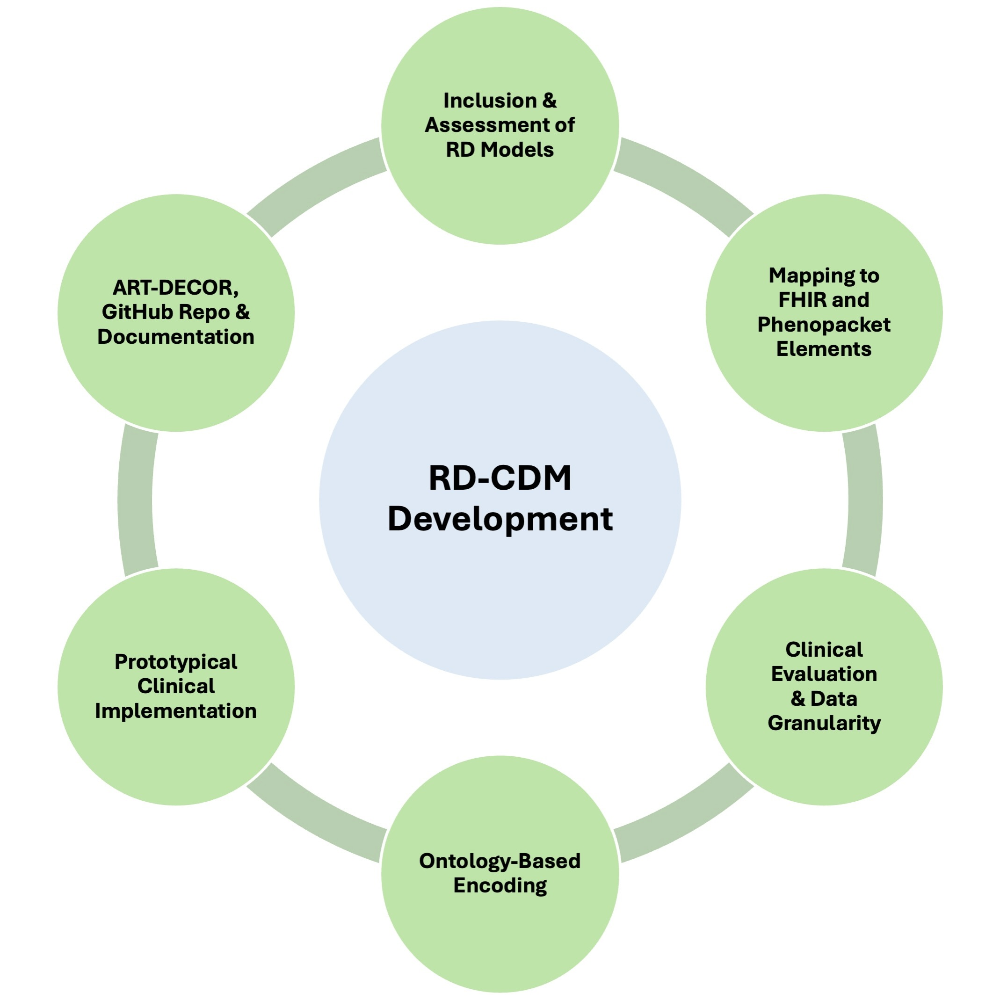

.. _background_file:

Background
=================

.. attention::
    The RD-CDM paper is currently under review. As soon as it is published, we
    will provide a link to the paper here and all tables and figures will be
    available in the paper.

Introduction
------------

Rare diseases (RDs), though individually rare, collectively impact over 260 
million people worldwide, with over 17 million affected in Europe. These
conditions, defined by their low prevalence of fewer than 5 in 10,000 
individuals, are often genetically driven, with over 70% of cases suspected to 
have a genetic cause. Despite significant advances in medical research, 
RD patients still face lengthy diagnostic delays, often due to a lack of 
awareness in general healthcare settings and the rarity of RD-specific knowledge
among clinicians. Misdiagnosis and underrepresentation in routine care further 
compound the challenges, leaving many patients without timely and accurate 
diagnoses.

Interoperability plays a critical role in addressing these challenges, 
ensuring the seamless exchange and interpretation of medical data through the 
use of internationally agreed standards. In the field of rare diseases, where 
data is often scarce and scattered, the importance of structured, standardized, 
and reusable medical records cannot be overstated. Interoperable data formats 
allow for more efficient research, better care coordination, and a clearer 
understanding of complex clinical cases. However, existing medical systems often
fail to support the depth of phenotypic and genotypic data required for rare 
disease research and treatment, making interoperability key for improving 
outcomes in RD care.

To address these needs, we introduce our RD-CDM v2.0.0 — a common data model 
specifically designed for rare diseases. This RD CDM simplifies the capture, 
storage, and exchange of complex clinical data, enabling researchers and 
healthcare providers to work with harmonized datasets across different 
institutions and countries. The RD-CDM is based on the ERDRI-CDS,
a common data set developed by the European Rare Disease Research
Infrastructure (ERDRI) to support the collection of harmonized data for rare
disease research. By extending the ERDRI-CDS with additional concepts and
relationships, based on HL7 FHIR v4.0.1 and the GA4GH Phenopacket Schema v2.0,
the RD CDM provides a comprehensive model for capturing detailed clinical
information alongisde precise genetic data on rare diseases.

Methodology
-------------------

Steps in the development of the ontology-based Rare Disease Common Data Model 
(RD-CDM) harmonising international registry use, FHIR and Phenopackets.As many 
steps were performed concurrently and overlapped across multiple sites, this 
methodology should be considered a non-hierarchical approach. First, we included
and assessed previous RD data models, followed by mapping elements to FHIR 
basic resources v4.0.1 and Phenopacket Schema v2.0 elements. A clinical 
evaluation was performed to assess the relevance of these elements while 
balancing the data model’s scope and spectrum of data granularity. We then 
performed ontology-based encoding to establish a common denominator between the 
models and data standards. Prototypical versions of our RD-CDM were implemented 
in REDCap, capturing real patient data from various RDs and use cases. 
Additionally, the project was developed in our public ART-DECOR project, and 
open-source GitHub repository alongside its documentation to ensure 
sustainability, reusability and flexibility for future improvements and usage.

Overview
---------------

Overview of the RD CDM v2.0.0 showing the data elements and sections. The RD CDM
does not define cardinalities or relationships to allow for nation-specific 
balloting and implementation.

.. note::
    The RD CDM is a community-driven project, and we welcome contributions from
    researchers, clinicians, and other stakeholders in the rare disease community.
    If you would like to contribute to the RD CDM, please read our `contributing
    guidelines <https://rd-cdm.readthedocs.io/en/latest/contributing.html>`_.

Table Columns
--------------------

This Figure Provides an overview of the table columns used to depict our Rare 
Disease Common Data Model (RD CDM). Each column's abbreviation, further 
definitions, and explanations are given. We recommend referring to this figure 
when reading the tables for each section of our RD CDM. 

.. note:: 
    The table can be found in Figshare at the following link:
    `RD CDM v2.0.0 Excel Table <https://figshare.com/articles/dataset/_b_Common_Data_Model_for_Rare_Diseases_b_based_on_the_ERDRI-CDS_HL7_FHIR_and_the_GA4GH_Phenopackets_Schema_v2_0_/26509150>`_.

    or can be downloaded here: 
    :download:`RD CDM v2.0.0 Excel Table <../_static/v2_0_0_dev0/RD CDM v2.0.0.xlsx>`. 

Layers of harmonisation
------------------------------

We analysed to what extent interoperability requirements were met 
while harmonising data elements from the ERDRI-CDS, HL7 FHIR resources and 
the GA4GH Phenopacket Schema to a single RD CDM. We identified six layers of 
harmonisation on the level of each data element: (1) the Alignment Layer, 
(2) the Labelling Layer, (3) the Terminology Binding Layer, (4) the Data 
Type Layer, (5) the Value Set Layer, and (6) the Value Set Choice Layer. All 
layers and their selection criteria are depicted in the figure below. 

While over 95% of all data elements are directly aligned with HL7 FHIR or GA4GH 
Phenopackets, only one-third of terminology bindings and 85% of value types 
match the specifications outlined by these standards. More than 87% of value 
sets being directly are aligned with the specifications defined by
HL7 FHIR and GA4GH Phenopacket Schema, 

.. attention::
    The RD-CDM paper is currently under review. As soon as it is published, we
    will provide a link to the paper here and all tables and figures will be
    available in the paper.

