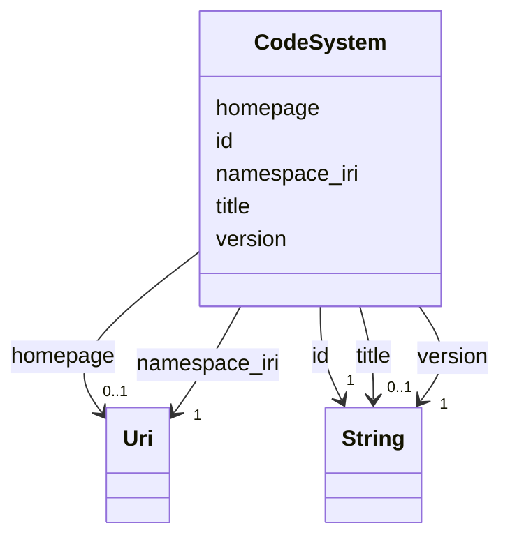

---
search:
  boost: 10.0
---

# Class: CodeSystem 


_Metadata for an ontology or code system_


<div data-search-exclude markdown="1">


URI: [https://github.com/BIH-CEI/rd-cdm/linkml/rd_cdm.schema.yaml/CodeSystem](https://github.com/BIH-CEI/rd-cdm/linkml/rd_cdm.schema.yaml/CodeSystem)





<!-- no inheritance hierarchy -->

## Slots

| Name | Cardinality and Range | Description | Inheritance |
| ---  | --- | --- | --- |
| [id](id.md) | 1 <br/> [xsd:string](http://www.w3.org/2001/XMLSchema#string) | The CURIE prefix used for terms in this code system (e | direct |
| [namespace_iri](namespace_iri.md) | 1 <br/> [xsd:anyURI](http://www.w3.org/2001/XMLSchema#anyURI) | The base namespace IRI for this ontology, used by OAKlib to expand CURIEs and... | direct |
| [version](version.md) | 1 <br/> [xsd:string](http://www.w3.org/2001/XMLSchema#string) | The release version or publication date of the ontology | direct |
| [title](title.md) | 0..1 <br/> [xsd:string](http://www.w3.org/2001/XMLSchema#string) | A human-readable title for this code system | direct |
| [homepage](homepage.md) | 0..1 <br/> [xsd:anyURI](http://www.w3.org/2001/XMLSchema#anyURI) | A URL for human browsing or documentation | direct |


## Usages

| used by | used in | type | used |
| ---  | --- | --- | --- |
| [RdCdm](RdCdm.md) | [code_systems](code_systems.md) | range | [CodeSystem](CodeSystem.md) |


## Identifier and Mapping Information


### Schema Source


* from schema: https://github.com/BIH-CEI/rd-cdm/linkml/rd_cdm.schema.yaml


## Mappings

| Mapping Type | Mapped Value |
| ---  | ---  |
| self | https://github.com/BIH-CEI/rd-cdm/linkml/rd_cdm.schema.yaml/CodeSystem |
| native | https://github.com/BIH-CEI/rd-cdm/linkml/rd_cdm.schema.yaml/CodeSystem |


## LinkML Source

<!-- TODO: investigate https://stackoverflow.com/questions/37606292/how-to-create-tabbed-code-blocks-in-mkdocs-or-sphinx -->

### Direct

<details>
```yaml
name: CodeSystem
description: Metadata for an ontology or code system
from_schema: https://github.com/BIH-CEI/rd-cdm/linkml/rd_cdm.schema.yaml
attributes:
  id:
    name: id
    description: 'The CURIE prefix used for terms in this code system (e.g. “ncbitaxon”,
      “snomedct”, “icd10cm”).

      '
    from_schema: https://github.com/BIH-CEI/rd-cdm/linkml/rd_cdm.schema.yaml
    rank: 1000
    identifier: true
    domain_of:
    - CodeSystem
    - ValueSet
    range: string
    required: true
  namespace_iri:
    name: namespace_iri
    description: 'The base namespace IRI for this ontology, used by OAKlib to expand
      CURIEs and load the adapter.

      '
    from_schema: https://github.com/BIH-CEI/rd-cdm/linkml/rd_cdm.schema.yaml
    rank: 1000
    domain_of:
    - CodeSystem
    range: uri
    required: true
  version:
    name: version
    description: The release version or publication date of the ontology
    from_schema: https://github.com/BIH-CEI/rd-cdm/linkml/rd_cdm.schema.yaml
    rank: 1000
    domain_of:
    - CodeSystem
    range: string
    required: true
  title:
    name: title
    description: A human-readable title for this code system
    from_schema: https://github.com/BIH-CEI/rd-cdm/linkml/rd_cdm.schema.yaml
    rank: 1000
    domain_of:
    - CodeSystem
    range: string
  homepage:
    name: homepage
    description: A URL for human browsing or documentation
    from_schema: https://github.com/BIH-CEI/rd-cdm/linkml/rd_cdm.schema.yaml
    rank: 1000
    domain_of:
    - CodeSystem
    range: uri

```
</details>

### Induced

<details>
```yaml
name: CodeSystem
description: Metadata for an ontology or code system
from_schema: https://github.com/BIH-CEI/rd-cdm/linkml/rd_cdm.schema.yaml
attributes:
  id:
    name: id
    description: 'The CURIE prefix used for terms in this code system (e.g. “ncbitaxon”,
      “snomedct”, “icd10cm”).

      '
    from_schema: https://github.com/BIH-CEI/rd-cdm/linkml/rd_cdm.schema.yaml
    rank: 1000
    identifier: true
    owner: CodeSystem
    domain_of:
    - CodeSystem
    - ValueSet
    range: string
    required: true
  namespace_iri:
    name: namespace_iri
    description: 'The base namespace IRI for this ontology, used by OAKlib to expand
      CURIEs and load the adapter.

      '
    from_schema: https://github.com/BIH-CEI/rd-cdm/linkml/rd_cdm.schema.yaml
    rank: 1000
    owner: CodeSystem
    domain_of:
    - CodeSystem
    range: uri
    required: true
  version:
    name: version
    description: The release version or publication date of the ontology
    from_schema: https://github.com/BIH-CEI/rd-cdm/linkml/rd_cdm.schema.yaml
    rank: 1000
    owner: CodeSystem
    domain_of:
    - CodeSystem
    range: string
    required: true
  title:
    name: title
    description: A human-readable title for this code system
    from_schema: https://github.com/BIH-CEI/rd-cdm/linkml/rd_cdm.schema.yaml
    rank: 1000
    owner: CodeSystem
    domain_of:
    - CodeSystem
    range: string
  homepage:
    name: homepage
    description: A URL for human browsing or documentation
    from_schema: https://github.com/BIH-CEI/rd-cdm/linkml/rd_cdm.schema.yaml
    rank: 1000
    owner: CodeSystem
    domain_of:
    - CodeSystem
    range: uri

```
</details></div>