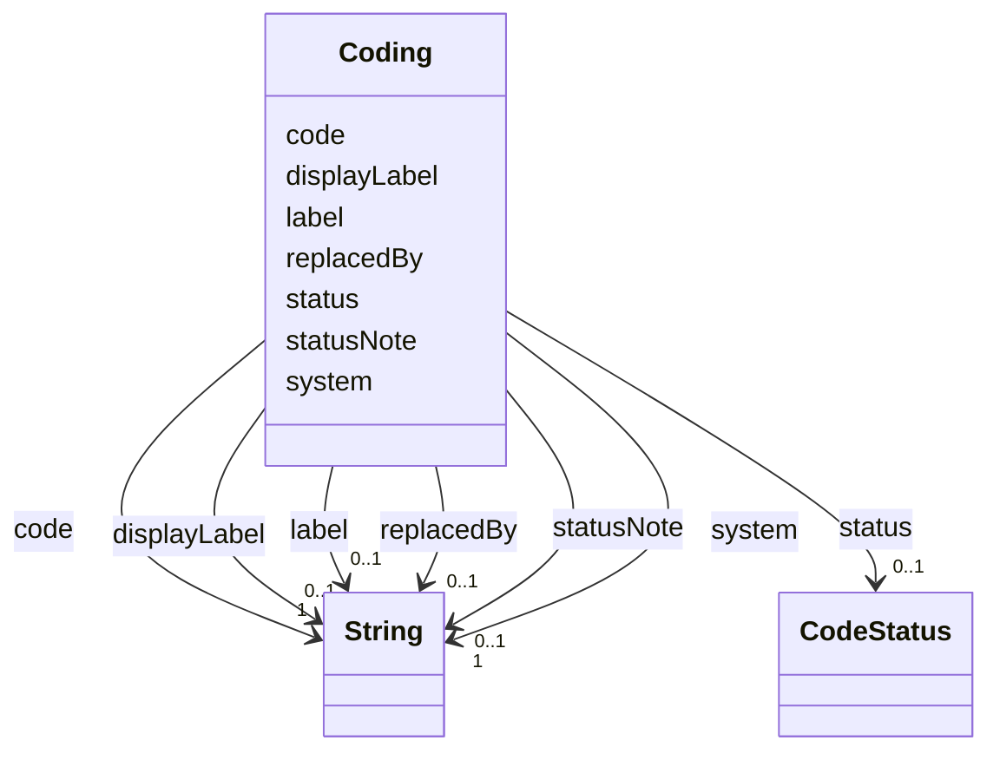

---
search:
  boost: 10.0
---

# Class: Coding 


_A code + code system reference_


<div data-search-exclude markdown="1">


URI: [https://github.com/BIH-CEI/rd-cdm/linkml/rd_cdm.schema.yaml/Coding](https://github.com/BIH-CEI/rd-cdm/linkml/rd_cdm.schema.yaml/Coding)





<!-- no inheritance hierarchy -->

## Slots

| Name | Cardinality and Range | Description | Inheritance |
| ---  | --- | --- | --- |
| [system](system.md) | 1 <br/> [xsd:string](http://www.w3.org/2001/XMLSchema#string) | CURIE for the code system | direct |
| [code](code.md) | 1 <br/> [xsd:string](http://www.w3.org/2001/XMLSchema#string) | The code within the system | direct |
| [label](label.md) | 0..1 <br/> [xsd:string](http://www.w3.org/2001/XMLSchema#string) | The preferred label of the code in its source terminology | direct |
| [displayLabel](displayLabel.md) | 0..1 <br/> [xsd:string](http://www.w3.org/2001/XMLSchema#string) | An optional presentation label for user interfaces and data capture forms, us... | direct |
| [status](status.md) | 0..1 <br/> [CodeStatus](CodeStatus.md) | Lifecycle of this code against the model's terminology authority | direct |
| [replacedBy](replacedBy.md) | 0..1 <br/> [xsd:string](http://www.w3.org/2001/XMLSchema#string) | The CURIE of the active code that a value recorded under an inactive one migr... | direct |
| [statusNote](statusNote.md) | 0..1 <br/> [xsd:string](http://www.w3.org/2001/XMLSchema#string) | Why a code carries a non-default status, and what a consumer should do about ... | direct |


## Usages

| used by | used in | type | used |
| ---  | --- | --- | --- |
| [ValueSet](ValueSet.md) | [codes](codes.md) | range | [Coding](Coding.md) |
| [DataElement](DataElement.md) | [elementCode](elementCode.md) | range | [Coding](Coding.md) |


## Identifier and Mapping Information


### Schema Source


* from schema: https://github.com/BIH-CEI/rd-cdm/linkml/rd_cdm.schema.yaml


## Mappings

| Mapping Type | Mapped Value |
| ---  | ---  |
| self | https://github.com/BIH-CEI/rd-cdm/linkml/rd_cdm.schema.yaml/Coding |
| native | https://github.com/BIH-CEI/rd-cdm/linkml/rd_cdm.schema.yaml/Coding |


## LinkML Source

<!-- TODO: investigate https://stackoverflow.com/questions/37606292/how-to-create-tabbed-code-blocks-in-mkdocs-or-sphinx -->

### Direct

<details>
```yaml
name: Coding
description: A code + code system reference
from_schema: https://github.com/BIH-CEI/rd-cdm/linkml/rd_cdm.schema.yaml
attributes:
  system:
    name: system
    description: CURIE for the code system
    from_schema: https://github.com/BIH-CEI/rd-cdm/linkml/rd_cdm.schema.yaml
    rank: 1000
    domain_of:
    - Coding
    range: string
    required: true
  code:
    name: code
    description: The code within the system
    from_schema: https://github.com/BIH-CEI/rd-cdm/linkml/rd_cdm.schema.yaml
    rank: 1000
    domain_of:
    - Coding
    range: string
    required: true
  label:
    name: label
    description: 'The preferred label of the code in its source terminology. This
      is the string `rd-cdm-validate` compares against the live ontology, so it must
      track the terminology rather than local presentation preferences.

      '
    from_schema: https://github.com/BIH-CEI/rd-cdm/linkml/rd_cdm.schema.yaml
    rank: 1000
    domain_of:
    - Coding
    - ValueSet
    range: string
  displayLabel:
    name: displayLabel
    description: 'An optional presentation label for user interfaces and data capture
      forms, used where the terminology''s preferred label is unhelpful to a data
      entrant (for example `XX` for `Karyotype 46, XX`). Never validated against the
      terminology.

      '
    from_schema: https://github.com/BIH-CEI/rd-cdm/linkml/rd_cdm.schema.yaml
    rank: 1000
    domain_of:
    - Coding
    range: string
  status:
    name: status
    description: 'Lifecycle of this code against the model''s terminology authority.
      Defaults to `active`. `inactive` records that the code no longer resolves in
      BioPortal, which is the single authority this model validates against - the
      RD-CDM does not consult a terminology''s own release files, so this is a statement
      about resolvability, not a claim about why the concept was withdrawn.

      An inactive code MUST NOT be offered for new data capture: a generator building
      a form or dropdown from this value set filters to `active`. It is kept in the
      value set so that data already captured against it stays interpretable - terminologies
      do not reuse identifiers, so the code still means exactly what it meant when
      it was recorded.

      '
    from_schema: https://github.com/BIH-CEI/rd-cdm/linkml/rd_cdm.schema.yaml
    rank: 1000
    domain_of:
    - Coding
    range: CodeStatus
  replacedBy:
    name: replacedBy
    description: 'The CURIE of the active code that a value recorded under an inactive
      one migrates to. The successor must itself be a member of the same value set,
      so a legacy value can be migrated without leaving it. Absent where no equivalent
      has been agreed.

      '
    from_schema: https://github.com/BIH-CEI/rd-cdm/linkml/rd_cdm.schema.yaml
    rank: 1000
    domain_of:
    - Coding
    range: string
  statusNote:
    name: statusNote
    description: 'Why a code carries a non-default status, and what a consumer should
      do about it. Required in practice for inactive codes.

      '
    from_schema: https://github.com/BIH-CEI/rd-cdm/linkml/rd_cdm.schema.yaml
    rank: 1000
    domain_of:
    - Coding
    range: string

```
</details>

### Induced

<details>
```yaml
name: Coding
description: A code + code system reference
from_schema: https://github.com/BIH-CEI/rd-cdm/linkml/rd_cdm.schema.yaml
attributes:
  system:
    name: system
    description: CURIE for the code system
    from_schema: https://github.com/BIH-CEI/rd-cdm/linkml/rd_cdm.schema.yaml
    rank: 1000
    owner: Coding
    domain_of:
    - Coding
    range: string
    required: true
  code:
    name: code
    description: The code within the system
    from_schema: https://github.com/BIH-CEI/rd-cdm/linkml/rd_cdm.schema.yaml
    rank: 1000
    owner: Coding
    domain_of:
    - Coding
    range: string
    required: true
  label:
    name: label
    description: 'The preferred label of the code in its source terminology. This
      is the string `rd-cdm-validate` compares against the live ontology, so it must
      track the terminology rather than local presentation preferences.

      '
    from_schema: https://github.com/BIH-CEI/rd-cdm/linkml/rd_cdm.schema.yaml
    rank: 1000
    owner: Coding
    domain_of:
    - Coding
    - ValueSet
    range: string
  displayLabel:
    name: displayLabel
    description: 'An optional presentation label for user interfaces and data capture
      forms, used where the terminology''s preferred label is unhelpful to a data
      entrant (for example `XX` for `Karyotype 46, XX`). Never validated against the
      terminology.

      '
    from_schema: https://github.com/BIH-CEI/rd-cdm/linkml/rd_cdm.schema.yaml
    rank: 1000
    owner: Coding
    domain_of:
    - Coding
    range: string
  status:
    name: status
    description: 'Lifecycle of this code against the model''s terminology authority.
      Defaults to `active`. `inactive` records that the code no longer resolves in
      BioPortal, which is the single authority this model validates against - the
      RD-CDM does not consult a terminology''s own release files, so this is a statement
      about resolvability, not a claim about why the concept was withdrawn.

      An inactive code MUST NOT be offered for new data capture: a generator building
      a form or dropdown from this value set filters to `active`. It is kept in the
      value set so that data already captured against it stays interpretable - terminologies
      do not reuse identifiers, so the code still means exactly what it meant when
      it was recorded.

      '
    from_schema: https://github.com/BIH-CEI/rd-cdm/linkml/rd_cdm.schema.yaml
    rank: 1000
    owner: Coding
    domain_of:
    - Coding
    range: CodeStatus
  replacedBy:
    name: replacedBy
    description: 'The CURIE of the active code that a value recorded under an inactive
      one migrates to. The successor must itself be a member of the same value set,
      so a legacy value can be migrated without leaving it. Absent where no equivalent
      has been agreed.

      '
    from_schema: https://github.com/BIH-CEI/rd-cdm/linkml/rd_cdm.schema.yaml
    rank: 1000
    owner: Coding
    domain_of:
    - Coding
    range: string
  statusNote:
    name: statusNote
    description: 'Why a code carries a non-default status, and what a consumer should
      do about it. Required in practice for inactive codes.

      '
    from_schema: https://github.com/BIH-CEI/rd-cdm/linkml/rd_cdm.schema.yaml
    rank: 1000
    owner: Coding
    domain_of:
    - Coding
    range: string

```
</details></div>