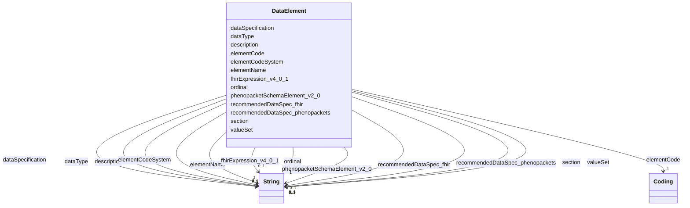

---
search:
  boost: 10.0
---

# Class: DataElement 


_A single data field in the RD-CDM_


<div data-search-exclude markdown="1">


URI: [https://github.com/BIH-CEI/rd-cdm/linkml/rd_cdm.schema.yaml/DataElement](https://github.com/BIH-CEI/rd-cdm/linkml/rd_cdm.schema.yaml/DataElement)





<!-- no inheritance hierarchy -->

## Slots

| Name | Cardinality and Range | Description | Inheritance |
| ---  | --- | --- | --- |
| [ordinal](ordinal.md) | 1 <br/> [xsd:string](http://www.w3.org/2001/XMLSchema#string) | Position within the form or section | direct |
| [section](section.md) | 0..1 <br/> [xsd:string](http://www.w3.org/2001/XMLSchema#string) | Logical grouping or heading | direct |
| [elementName](elementName.md) | 1 <br/> [xsd:string](http://www.w3.org/2001/XMLSchema#string) | Human-readable name of the element | direct |
| [elementCode](elementCode.md) | 1 <br/> [Coding](Coding.md) | Primary code describing the element | direct |
| [elementCodeSystem](elementCodeSystem.md) | 1 <br/> [xsd:string](http://www.w3.org/2001/XMLSchema#string) | Identifier of the code system (matches one of the `CodeSystem | direct |
| [dataType](dataType.md) | 0..1 <br/> [xsd:string](http://www.w3.org/2001/XMLSchema#string) | Data type (e | direct |
| [dataSpecification](dataSpecification.md) | * <br/> [xsd:string](http://www.w3.org/2001/XMLSchema#string) | Reference or link to specification | direct |
| [valueSet](valueSet.md) | 0..1 <br/> [xsd:string](http://www.w3.org/2001/XMLSchema#string) | The `label` of the ValueSet constraining this element - not its `id` | direct |
| [fhirExpression_v4_0_1](fhirExpression_v4_0_1.md) | 0..1 <br/> [xsd:string](http://www.w3.org/2001/XMLSchema#string) | FHIRPath expression for FHIR mapping | direct |
| [recommendedDataSpec_fhir](recommendedDataSpec_fhir.md) | 0..1 <br/> [xsd:string](http://www.w3.org/2001/XMLSchema#string) | Recommendations for FHIR profiling | direct |
| [phenopacketSchemaElement_v2_0](phenopacketSchemaElement_v2_0.md) | 0..1 <br/> [xsd:string](http://www.w3.org/2001/XMLSchema#string) | Phenopacket schema path | direct |
| [recommendedDataSpec_phenopackets](recommendedDataSpec_phenopackets.md) | 0..1 <br/> [xsd:string](http://www.w3.org/2001/XMLSchema#string) | Recommended Phenopacket datatype or format | direct |
| [description](description.md) | 0..1 <br/> [xsd:string](http://www.w3.org/2001/XMLSchema#string) | Full textual description of the element | direct |


## Usages

| used by | used in | type | used |
| ---  | --- | --- | --- |
| [RdCdm](RdCdm.md) | [data_elements](data_elements.md) | range | [DataElement](DataElement.md) |


## Identifier and Mapping Information


### Schema Source


* from schema: https://github.com/BIH-CEI/rd-cdm/linkml/rd_cdm.schema.yaml


## Mappings

| Mapping Type | Mapped Value |
| ---  | ---  |
| self | https://github.com/BIH-CEI/rd-cdm/linkml/rd_cdm.schema.yaml/DataElement |
| native | https://github.com/BIH-CEI/rd-cdm/linkml/rd_cdm.schema.yaml/DataElement |


## LinkML Source

<!-- TODO: investigate https://stackoverflow.com/questions/37606292/how-to-create-tabbed-code-blocks-in-mkdocs-or-sphinx -->

### Direct

<details>
```yaml
name: DataElement
description: A single data field in the RD-CDM
from_schema: https://github.com/BIH-CEI/rd-cdm/linkml/rd_cdm.schema.yaml
attributes:
  ordinal:
    name: ordinal
    description: Position within the form or section
    from_schema: https://github.com/BIH-CEI/rd-cdm/linkml/rd_cdm.schema.yaml
    rank: 1000
    domain_of:
    - DataElement
    range: string
    required: true
  section:
    name: section
    description: Logical grouping or heading
    from_schema: https://github.com/BIH-CEI/rd-cdm/linkml/rd_cdm.schema.yaml
    rank: 1000
    domain_of:
    - DataElement
    range: string
  elementName:
    name: elementName
    description: Human-readable name of the element
    from_schema: https://github.com/BIH-CEI/rd-cdm/linkml/rd_cdm.schema.yaml
    rank: 1000
    domain_of:
    - DataElement
    range: string
    required: true
  elementCode:
    name: elementCode
    description: Primary code describing the element
    from_schema: https://github.com/BIH-CEI/rd-cdm/linkml/rd_cdm.schema.yaml
    rank: 1000
    domain_of:
    - DataElement
    range: Coding
    required: true
  elementCodeSystem:
    name: elementCodeSystem
    description: Identifier of the code system (matches one of the `CodeSystem.id`
      values, e.g. “SNOMEDCT”, “LOINC”, “CustomCode”).
    from_schema: https://github.com/BIH-CEI/rd-cdm/linkml/rd_cdm.schema.yaml
    rank: 1000
    domain_of:
    - DataElement
    range: string
    required: true
  dataType:
    name: dataType
    description: Data type (e.g., string, integer, identifier)
    from_schema: https://github.com/BIH-CEI/rd-cdm/linkml/rd_cdm.schema.yaml
    rank: 1000
    domain_of:
    - DataElement
    range: string
  dataSpecification:
    name: dataSpecification
    description: Reference or link to specification
    from_schema: https://github.com/BIH-CEI/rd-cdm/linkml/rd_cdm.schema.yaml
    rank: 1000
    domain_of:
    - DataElement
    range: string
    multivalued: true
  valueSet:
    name: valueSet
    description: 'The `label` of the ValueSet constraining this element - not its
      `id`. Value set labels are therefore unique, and a value set''s `id` is by convention
      the CURIE of the element it constrains. Both are enforced by `rd_cdm.utils.structure_checks`.

      '
    from_schema: https://github.com/BIH-CEI/rd-cdm/linkml/rd_cdm.schema.yaml
    rank: 1000
    domain_of:
    - DataElement
    range: string
  fhirExpression_v4_0_1:
    name: fhirExpression_v4_0_1
    description: FHIRPath expression for FHIR mapping
    from_schema: https://github.com/BIH-CEI/rd-cdm/linkml/rd_cdm.schema.yaml
    rank: 1000
    domain_of:
    - DataElement
    range: string
  recommendedDataSpec_fhir:
    name: recommendedDataSpec_fhir
    description: Recommendations for FHIR profiling
    from_schema: https://github.com/BIH-CEI/rd-cdm/linkml/rd_cdm.schema.yaml
    rank: 1000
    domain_of:
    - DataElement
    range: string
  phenopacketSchemaElement_v2_0:
    name: phenopacketSchemaElement_v2_0
    description: Phenopacket schema path
    from_schema: https://github.com/BIH-CEI/rd-cdm/linkml/rd_cdm.schema.yaml
    rank: 1000
    domain_of:
    - DataElement
    range: string
  recommendedDataSpec_phenopackets:
    name: recommendedDataSpec_phenopackets
    description: Recommended Phenopacket datatype or format
    from_schema: https://github.com/BIH-CEI/rd-cdm/linkml/rd_cdm.schema.yaml
    rank: 1000
    domain_of:
    - DataElement
    range: string
  description:
    name: description
    description: Full textual description of the element
    from_schema: https://github.com/BIH-CEI/rd-cdm/linkml/rd_cdm.schema.yaml
    rank: 1000
    domain_of:
    - DataElement
    range: string

```
</details>

### Induced

<details>
```yaml
name: DataElement
description: A single data field in the RD-CDM
from_schema: https://github.com/BIH-CEI/rd-cdm/linkml/rd_cdm.schema.yaml
attributes:
  ordinal:
    name: ordinal
    description: Position within the form or section
    from_schema: https://github.com/BIH-CEI/rd-cdm/linkml/rd_cdm.schema.yaml
    rank: 1000
    owner: DataElement
    domain_of:
    - DataElement
    range: string
    required: true
  section:
    name: section
    description: Logical grouping or heading
    from_schema: https://github.com/BIH-CEI/rd-cdm/linkml/rd_cdm.schema.yaml
    rank: 1000
    owner: DataElement
    domain_of:
    - DataElement
    range: string
  elementName:
    name: elementName
    description: Human-readable name of the element
    from_schema: https://github.com/BIH-CEI/rd-cdm/linkml/rd_cdm.schema.yaml
    rank: 1000
    owner: DataElement
    domain_of:
    - DataElement
    range: string
    required: true
  elementCode:
    name: elementCode
    description: Primary code describing the element
    from_schema: https://github.com/BIH-CEI/rd-cdm/linkml/rd_cdm.schema.yaml
    rank: 1000
    owner: DataElement
    domain_of:
    - DataElement
    range: Coding
    required: true
  elementCodeSystem:
    name: elementCodeSystem
    description: Identifier of the code system (matches one of the `CodeSystem.id`
      values, e.g. “SNOMEDCT”, “LOINC”, “CustomCode”).
    from_schema: https://github.com/BIH-CEI/rd-cdm/linkml/rd_cdm.schema.yaml
    rank: 1000
    owner: DataElement
    domain_of:
    - DataElement
    range: string
    required: true
  dataType:
    name: dataType
    description: Data type (e.g., string, integer, identifier)
    from_schema: https://github.com/BIH-CEI/rd-cdm/linkml/rd_cdm.schema.yaml
    rank: 1000
    owner: DataElement
    domain_of:
    - DataElement
    range: string
  dataSpecification:
    name: dataSpecification
    description: Reference or link to specification
    from_schema: https://github.com/BIH-CEI/rd-cdm/linkml/rd_cdm.schema.yaml
    rank: 1000
    owner: DataElement
    domain_of:
    - DataElement
    range: string
    multivalued: true
  valueSet:
    name: valueSet
    description: 'The `label` of the ValueSet constraining this element - not its
      `id`. Value set labels are therefore unique, and a value set''s `id` is by convention
      the CURIE of the element it constrains. Both are enforced by `rd_cdm.utils.structure_checks`.

      '
    from_schema: https://github.com/BIH-CEI/rd-cdm/linkml/rd_cdm.schema.yaml
    rank: 1000
    owner: DataElement
    domain_of:
    - DataElement
    range: string
  fhirExpression_v4_0_1:
    name: fhirExpression_v4_0_1
    description: FHIRPath expression for FHIR mapping
    from_schema: https://github.com/BIH-CEI/rd-cdm/linkml/rd_cdm.schema.yaml
    rank: 1000
    owner: DataElement
    domain_of:
    - DataElement
    range: string
  recommendedDataSpec_fhir:
    name: recommendedDataSpec_fhir
    description: Recommendations for FHIR profiling
    from_schema: https://github.com/BIH-CEI/rd-cdm/linkml/rd_cdm.schema.yaml
    rank: 1000
    owner: DataElement
    domain_of:
    - DataElement
    range: string
  phenopacketSchemaElement_v2_0:
    name: phenopacketSchemaElement_v2_0
    description: Phenopacket schema path
    from_schema: https://github.com/BIH-CEI/rd-cdm/linkml/rd_cdm.schema.yaml
    rank: 1000
    owner: DataElement
    domain_of:
    - DataElement
    range: string
  recommendedDataSpec_phenopackets:
    name: recommendedDataSpec_phenopackets
    description: Recommended Phenopacket datatype or format
    from_schema: https://github.com/BIH-CEI/rd-cdm/linkml/rd_cdm.schema.yaml
    rank: 1000
    owner: DataElement
    domain_of:
    - DataElement
    range: string
  description:
    name: description
    description: Full textual description of the element
    from_schema: https://github.com/BIH-CEI/rd-cdm/linkml/rd_cdm.schema.yaml
    rank: 1000
    owner: DataElement
    domain_of:
    - DataElement
    range: string

```
</details></div>