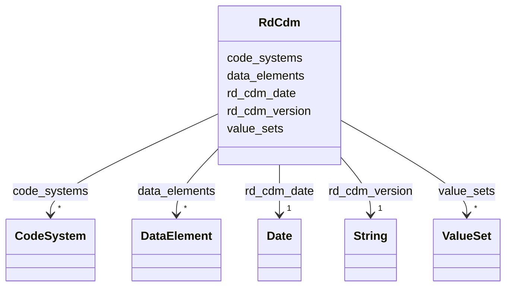

---
search:
  boost: 10.0
---

# Class: RdCdm 


_Root class for the Rare Disease Common Data Model (RD-CDM)_


<div data-search-exclude markdown="1">


URI: [https://github.com/BIH-CEI/rd-cdm/linkml/rd_cdm.schema.yaml/RdCdm](https://github.com/BIH-CEI/rd-cdm/linkml/rd_cdm.schema.yaml/RdCdm)





<!-- no inheritance hierarchy -->

## Class Properties

| Property | Value |
| --- | --- |
| Tree Root | Yes |


## Slots

| Name | Cardinality and Range | Description | Inheritance |
| ---  | --- | --- | --- |
| [rd_cdm_version](rd_cdm_version.md) | 1 <br/> [xsd:string](http://www.w3.org/2001/XMLSchema#string) | Version of the RD-CDM schema | direct |
| [rd_cdm_date](rd_cdm_date.md) | 1 <br/> [xsd:date](http://www.w3.org/2001/XMLSchema#date) | Date of the RD-CDM release | direct |
| [code_systems](code_systems.md) | * <br/> [CodeSystem](CodeSystem.md) |  | direct |
| [data_elements](data_elements.md) | * <br/> [DataElement](DataElement.md) |  | direct |
| [value_sets](value_sets.md) | * <br/> [ValueSet](ValueSet.md) |  | direct |


## Identifier and Mapping Information


### Schema Source


* from schema: https://github.com/BIH-CEI/rd-cdm/linkml/rd_cdm.schema.yaml


## Mappings

| Mapping Type | Mapped Value |
| ---  | ---  |
| self | https://github.com/BIH-CEI/rd-cdm/linkml/rd_cdm.schema.yaml/RdCdm |
| native | https://github.com/BIH-CEI/rd-cdm/linkml/rd_cdm.schema.yaml/RdCdm |


## LinkML Source

<!-- TODO: investigate https://stackoverflow.com/questions/37606292/how-to-create-tabbed-code-blocks-in-mkdocs-or-sphinx -->

### Direct

<details>
```yaml
name: RdCdm
description: Root class for the Rare Disease Common Data Model (RD-CDM)
from_schema: https://github.com/BIH-CEI/rd-cdm/linkml/rd_cdm.schema.yaml
attributes:
  rd_cdm_version:
    name: rd_cdm_version
    description: Version of the RD-CDM schema
    from_schema: https://github.com/BIH-CEI/rd-cdm/linkml/rd_cdm.schema.yaml
    rank: 1000
    domain_of:
    - RdCdm
    range: string
    required: true
  rd_cdm_date:
    name: rd_cdm_date
    description: Date of the RD-CDM release
    from_schema: https://github.com/BIH-CEI/rd-cdm/linkml/rd_cdm.schema.yaml
    rank: 1000
    domain_of:
    - RdCdm
    range: date
    required: true
  code_systems:
    name: code_systems
    from_schema: https://github.com/BIH-CEI/rd-cdm/linkml/rd_cdm.schema.yaml
    rank: 1000
    domain_of:
    - RdCdm
    range: CodeSystem
    multivalued: true
    inlined_as_list: true
  data_elements:
    name: data_elements
    from_schema: https://github.com/BIH-CEI/rd-cdm/linkml/rd_cdm.schema.yaml
    rank: 1000
    domain_of:
    - RdCdm
    range: DataElement
    multivalued: true
    inlined_as_list: true
  value_sets:
    name: value_sets
    from_schema: https://github.com/BIH-CEI/rd-cdm/linkml/rd_cdm.schema.yaml
    rank: 1000
    domain_of:
    - RdCdm
    range: ValueSet
    multivalued: true
    inlined_as_list: true
tree_root: true

```
</details>

### Induced

<details>
```yaml
name: RdCdm
description: Root class for the Rare Disease Common Data Model (RD-CDM)
from_schema: https://github.com/BIH-CEI/rd-cdm/linkml/rd_cdm.schema.yaml
attributes:
  rd_cdm_version:
    name: rd_cdm_version
    description: Version of the RD-CDM schema
    from_schema: https://github.com/BIH-CEI/rd-cdm/linkml/rd_cdm.schema.yaml
    rank: 1000
    owner: RdCdm
    domain_of:
    - RdCdm
    range: string
    required: true
  rd_cdm_date:
    name: rd_cdm_date
    description: Date of the RD-CDM release
    from_schema: https://github.com/BIH-CEI/rd-cdm/linkml/rd_cdm.schema.yaml
    rank: 1000
    owner: RdCdm
    domain_of:
    - RdCdm
    range: date
    required: true
  code_systems:
    name: code_systems
    from_schema: https://github.com/BIH-CEI/rd-cdm/linkml/rd_cdm.schema.yaml
    rank: 1000
    owner: RdCdm
    domain_of:
    - RdCdm
    range: CodeSystem
    multivalued: true
    inlined: true
    inlined_as_list: true
  data_elements:
    name: data_elements
    from_schema: https://github.com/BIH-CEI/rd-cdm/linkml/rd_cdm.schema.yaml
    rank: 1000
    owner: RdCdm
    domain_of:
    - RdCdm
    range: DataElement
    multivalued: true
    inlined: true
    inlined_as_list: true
  value_sets:
    name: value_sets
    from_schema: https://github.com/BIH-CEI/rd-cdm/linkml/rd_cdm.schema.yaml
    rank: 1000
    owner: RdCdm
    domain_of:
    - RdCdm
    range: ValueSet
    multivalued: true
    inlined: true
    inlined_as_list: true
tree_root: true

```
</details></div>