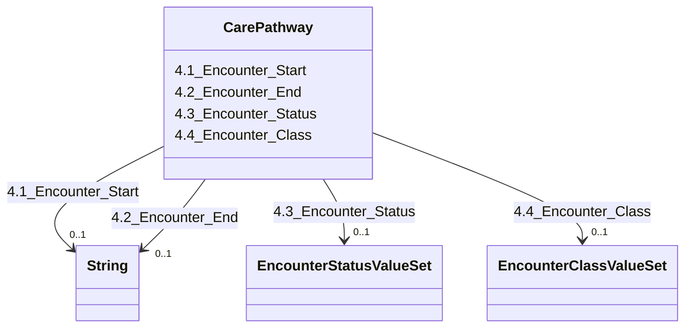

---
search:
  boost: 10.0
---

# Class: CarePathway 


_4. Care Pathway_


<div data-search-exclude markdown="1">


URI: [rdcdm:CarePathway](https://github.com/BIH-CEI/rd-cdm/CarePathway)





<!-- no inheritance hierarchy -->

## Slots

| Name | Cardinality and Range | Description | Inheritance |
| ---  | --- | --- | --- |
| [4.1_Encounter_Start](4.1_Encounter_Start.md) | 0..1 <br/> [xsd:string](http://www.w3.org/2001/XMLSchema#string) | The beginning of an encounter of the individual | direct |
| [4.2_Encounter_End](4.2_Encounter_End.md) | 0..1 <br/> [xsd:string](http://www.w3.org/2001/XMLSchema#string) | The end of an encounter of the individual | direct |
| [4.3_Encounter_Status](4.3_Encounter_Status.md) | 0..1 <br/> [EncounterStatusValueSet](EncounterStatusValueSet.md) | The status of an encounter of the individual at thetime of data capture | direct |
| [4.4_Encounter_Class](4.4_Encounter_Class.md) | 0..1 <br/> [EncounterClassValueSet](EncounterClassValueSet.md) | The class of an encounter of the individualat the time of data capture | direct |


## Identifier and Mapping Information


### Schema Source


* from schema: https://github.com/BIH-CEI/rd-cdm/linkml/rd_cdm_profile.yaml


## Mappings

| Mapping Type | Mapped Value |
| ---  | ---  |
| self | rdcdm:CarePathway |
| native | rdcdm:CarePathway |


## LinkML Source

<!-- TODO: investigate https://stackoverflow.com/questions/37606292/how-to-create-tabbed-code-blocks-in-mkdocs-or-sphinx -->

### Direct

<details>
```yaml
name: CarePathway
description: 4. Care Pathway
from_schema: https://github.com/BIH-CEI/rd-cdm/linkml/rd_cdm_profile.yaml
slots:
- 4.1 Encounter Start
- 4.2 Encounter End
- 4.3 Encounter Status
- 4.4 Encounter Class

```
</details>

### Induced

<details>
```yaml
name: CarePathway
description: 4. Care Pathway
from_schema: https://github.com/BIH-CEI/rd-cdm/linkml/rd_cdm_profile.yaml
attributes:
  4.1 Encounter Start:
    name: 4.1 Encounter Start
    annotations:
      ordinal:
        tag: ordinal
        value: '4.1'
      section:
        tag: section
        value: 4. Care Pathway
      data_type:
        tag: data_type
        value: Date
      data_specification:
        tag: data_specification
        value: YYYY-MM-DD
      fhir_expression:
        tag: fhir_expression
        value: Encounter.period.start
      fhir_datatype:
        tag: fhir_datatype
        value: DateTime
    description: The beginning of an encounter of the individual.
    title: 4.1 Encounter Start
    from_schema: https://github.com/BIH-CEI/rd-cdm/linkml/rd_cdm_profile.yaml
    rank: 1000
    slot_uri: HL7FHIR:encounter.period.start
    alias: 4.1_Encounter_Start
    owner: CarePathway
    domain_of:
    - CarePathway
    range: string
  4.2 Encounter End:
    name: 4.2 Encounter End
    annotations:
      ordinal:
        tag: ordinal
        value: '4.2'
      section:
        tag: section
        value: 4. Care Pathway
      data_type:
        tag: data_type
        value: Date
      data_specification:
        tag: data_specification
        value: YYYY-MM-DD
      fhir_expression:
        tag: fhir_expression
        value: Encounter.period.end
      fhir_datatype:
        tag: fhir_datatype
        value: DateTime
    description: The end of an encounter of the individual.
    title: 4.2 Encounter End
    from_schema: https://github.com/BIH-CEI/rd-cdm/linkml/rd_cdm_profile.yaml
    rank: 1000
    slot_uri: HL7FHIR:encounter.period.end
    alias: 4.2_Encounter_End
    owner: CarePathway
    domain_of:
    - CarePathway
    range: string
  4.3 Encounter Status:
    name: 4.3 Encounter Status
    annotations:
      ordinal:
        tag: ordinal
        value: '4.3'
      section:
        tag: section
        value: 4. Care Pathway
      data_type:
        tag: data_type
        value: Code
      data_specification:
        tag: data_specification
        value: VSe, VSc
      fhir_expression:
        tag: fhir_expression
        value: Encounter.status
      fhir_datatype:
        tag: fhir_datatype
        value: 'ValueSet: EncounterStatus'
    description: The status of an encounter of the individual at thetime of data capture.
    title: 4.3 Encounter Status
    from_schema: https://github.com/BIH-CEI/rd-cdm/linkml/rd_cdm_profile.yaml
    rank: 1000
    slot_uri: SNOMEDCT:305058001
    alias: 4.3_Encounter_Status
    owner: CarePathway
    domain_of:
    - CarePathway
    range: EncounterStatusValueSet
  4.4 Encounter Class:
    name: 4.4 Encounter Class
    annotations:
      ordinal:
        tag: ordinal
        value: '4.4'
      section:
        tag: section
        value: 4. Care Pathway
      data_type:
        tag: data_type
        value: Code
      data_specification:
        tag: data_specification
        value: VSe, VSc
      fhir_expression:
        tag: fhir_expression
        value: Encounter.class
      fhir_datatype:
        tag: fhir_datatype
        value: 'ValueSet: EncounterClass'
    description: The class of an encounter of the individualat the time of data capture.
    title: 4.4 Encounter Class
    from_schema: https://github.com/BIH-CEI/rd-cdm/linkml/rd_cdm_profile.yaml
    rank: 1000
    slot_uri: HL7FHIR:encounter.class
    alias: 4.4_Encounter_Class
    owner: CarePathway
    domain_of:
    - CarePathway
    range: EncounterClassValueSet

```
</details></div>