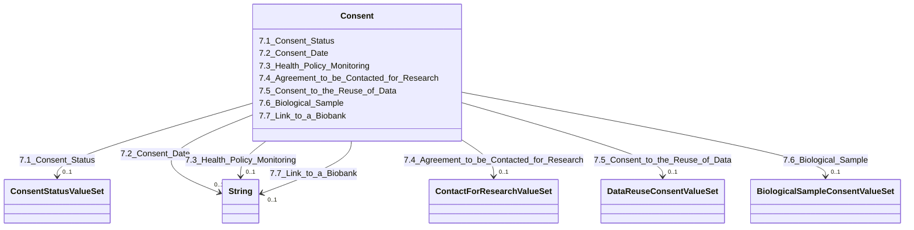

---
search:
  boost: 10.0
---

# Class: Consent 


_7. Consent_


<div data-search-exclude markdown="1">


URI: [rdcdm:Consent](https://github.com/BIH-CEI/rd-cdm/Consent)





<!-- no inheritance hierarchy -->

## Slots

| Name | Cardinality and Range | Description | Inheritance |
| ---  | --- | --- | --- |
| [7.1_Consent_Status](7.1_Consent_Status.md) | 0..1 <br/> [ConsentStatusValueSet](ConsentStatusValueSet.md) | Indicates the current status of the consent | direct |
| [7.2_Consent_Date](7.2_Consent_Date.md) | 0..1 <br/> [xsd:string](http://www.w3.org/2001/XMLSchema#string) | Records the date when the consent was given | direct |
| [7.3_Health_Policy_Monitoring](7.3_Health_Policy_Monitoring.md) | 0..1 <br/> [xsd:string](http://www.w3.org/2001/XMLSchema#string) | References to the policies that are included in thisconsent scope | direct |
| [7.4_Agreement_to_be_Contacted_for_Research](7.4_Agreement_to_be_Contacted_for_Research.md) | 0..1 <br/> [ContactForResearchValueSet](ContactForResearchValueSet.md) | Indicates whether the patient agrees to be contacted for research | direct |
| [7.5_Consent_to_the_Reuse_of_Data](7.5_Consent_to_the_Reuse_of_Data.md) | 0..1 <br/> [DataReuseConsentValueSet](DataReuseConsentValueSet.md) | Indicates whether the patient consents to the reuse of their data | direct |
| [7.6_Biological_Sample](7.6_Biological_Sample.md) | 0..1 <br/> [BiologicalSampleConsentValueSet](BiologicalSampleConsentValueSet.md) | Indicates whether a patient's biological sample is available for research | direct |
| [7.7_Link_to_a_Biobank](7.7_Link_to_a_Biobank.md) | 0..1 <br/> [xsd:string](http://www.w3.org/2001/XMLSchema#string) | If there is a biological sample, this data element indicates the link to the ... | direct |


## Identifier and Mapping Information


### Schema Source


* from schema: https://github.com/BIH-CEI/rd-cdm/linkml/rd_cdm_profile.yaml


## Mappings

| Mapping Type | Mapped Value |
| ---  | ---  |
| self | rdcdm:Consent |
| native | rdcdm:Consent |


## LinkML Source

<!-- TODO: investigate https://stackoverflow.com/questions/37606292/how-to-create-tabbed-code-blocks-in-mkdocs-or-sphinx -->

### Direct

<details>
```yaml
name: Consent
description: 7. Consent
from_schema: https://github.com/BIH-CEI/rd-cdm/linkml/rd_cdm_profile.yaml
slots:
- 7.1 Consent Status
- 7.2 Consent Date
- 7.3 Health Policy Monitoring
- 7.4 Agreement to be Contacted for Research
- 7.5 Consent to the Reuse of Data
- 7.6 Biological Sample
- 7.7 Link to a Biobank

```
</details>

### Induced

<details>
```yaml
name: Consent
description: 7. Consent
from_schema: https://github.com/BIH-CEI/rd-cdm/linkml/rd_cdm_profile.yaml
attributes:
  7.1 Consent Status:
    name: 7.1 Consent Status
    annotations:
      ordinal:
        tag: ordinal
        value: '7.1'
      section:
        tag: section
        value: 7. Consent
      data_type:
        tag: data_type
        value: Code
      data_specification:
        tag: data_specification
        value: VS
      fhir_expression:
        tag: fhir_expression
        value: Consent.status
      fhir_datatype:
        tag: fhir_datatype
        value: 'ValueSet: ConsentStatus'
    description: Indicates the current status of the consent.
    title: 7.1 Consent Status
    from_schema: https://github.com/BIH-CEI/rd-cdm/linkml/rd_cdm_profile.yaml
    rank: 1000
    slot_uri: SNOMEDCT:309370004
    alias: 7.1_Consent_Status
    owner: Consent
    domain_of:
    - Consent
    range: ConsentStatusValueSet
  7.2 Consent Date:
    name: 7.2 Consent Date
    annotations:
      ordinal:
        tag: ordinal
        value: '7.2'
      section:
        tag: section
        value: 7. Consent
      data_type:
        tag: data_type
        value: Date
      data_specification:
        tag: data_specification
        value: YYYY-MM-DD
      fhir_expression:
        tag: fhir_expression
        value: Consent.dateTime
      fhir_datatype:
        tag: fhir_datatype
        value: DateTime
    description: Records the date when the consent was given.
    title: 7.2 Consent Date
    from_schema: https://github.com/BIH-CEI/rd-cdm/linkml/rd_cdm_profile.yaml
    rank: 1000
    slot_uri: HL7FHIR:consent.datetime
    alias: 7.2_Consent_Date
    owner: Consent
    domain_of:
    - Consent
    range: string
  7.3 Health Policy Monitoring:
    name: 7.3 Health Policy Monitoring
    annotations:
      ordinal:
        tag: ordinal
        value: '7.3'
      section:
        tag: section
        value: 7. Consent
      data_type:
        tag: data_type
        value: String
      fhir_expression:
        tag: fhir_expression
        value: Consent.policy
      fhir_datatype:
        tag: fhir_datatype
        value: string
    description: References to the policies that are included in thisconsent scope.
    title: 7.3 Health Policy Monitoring
    from_schema: https://github.com/BIH-CEI/rd-cdm/linkml/rd_cdm_profile.yaml
    rank: 1000
    slot_uri: SNOMEDCT:386318002
    alias: 7.3_Health_Policy_Monitoring
    owner: Consent
    domain_of:
    - Consent
    range: string
  7.4 Agreement to be Contacted for Research:
    name: 7.4 Agreement to be Contacted for Research
    annotations:
      ordinal:
        tag: ordinal
        value: '7.4'
      section:
        tag: section
        value: 7. Consent
      data_type:
        tag: data_type
        value: Code
      data_specification:
        tag: data_specification
        value: VSe
      fhir_expression:
        tag: fhir_expression
        value: Consent.scope.coding
      fhir_datatype:
        tag: fhir_datatype
        value: CodeableConcept
    description: Indicates whether the patient agrees to be contacted for research.
    title: 7.4 Agreement to be Contacted for Research
    from_schema: https://github.com/BIH-CEI/rd-cdm/linkml/rd_cdm_profile.yaml
    rank: 1000
    slot_uri: CustomCode:consent_contact_research
    alias: 7.4_Agreement_to_be_Contacted_for_Research
    owner: Consent
    domain_of:
    - Consent
    range: ContactForResearchValueSet
  7.5 Consent to the Reuse of Data:
    name: 7.5 Consent to the Reuse of Data
    annotations:
      ordinal:
        tag: ordinal
        value: '7.5'
      section:
        tag: section
        value: 7. Consent
      data_type:
        tag: data_type
        value: Code
      data_specification:
        tag: data_specification
        value: VSe
      fhir_expression:
        tag: fhir_expression
        value: Consent.scope.coding
      fhir_datatype:
        tag: fhir_datatype
        value: CodeableConcept
    description: Indicates whether the patient consents to the reuse of their data.
    title: 7.5 Consent to the Reuse of Data
    from_schema: https://github.com/BIH-CEI/rd-cdm/linkml/rd_cdm_profile.yaml
    rank: 1000
    slot_uri: CustomCode:consent_data_reuse
    alias: 7.5_Consent_to_the_Reuse_of_Data
    owner: Consent
    domain_of:
    - Consent
    range: DataReuseConsentValueSet
  7.6 Biological Sample:
    name: 7.6 Biological Sample
    annotations:
      ordinal:
        tag: ordinal
        value: '7.6'
      section:
        tag: section
        value: 7. Consent
      data_type:
        tag: data_type
        value: Code
      data_specification:
        tag: data_specification
        value: VSe
    description: Indicates whether a patient's biological sample is available for
      research.
    title: 7.6 Biological Sample
    from_schema: https://github.com/BIH-CEI/rd-cdm/linkml/rd_cdm_profile.yaml
    rank: 1000
    slot_uri: SNOMEDCT:123038009
    alias: 7.6_Biological_Sample
    owner: Consent
    domain_of:
    - Consent
    range: BiologicalSampleConsentValueSet
  7.7 Link to a Biobank:
    name: 7.7 Link to a Biobank
    annotations:
      ordinal:
        tag: ordinal
        value: '7.7'
      section:
        tag: section
        value: 7. Consent
      data_type:
        tag: data_type
        value: String
    description: If there is a biological sample, this data element indicates the
      link to the biobank of the individual's biological sample.
    title: 7.7 Link to a Biobank
    from_schema: https://github.com/BIH-CEI/rd-cdm/linkml/rd_cdm_profile.yaml
    rank: 1000
    slot_uri: CustomCode:biobank_link
    alias: 7.7_Link_to_a_Biobank
    owner: Consent
    domain_of:
    - Consent
    range: string

```
</details></div>