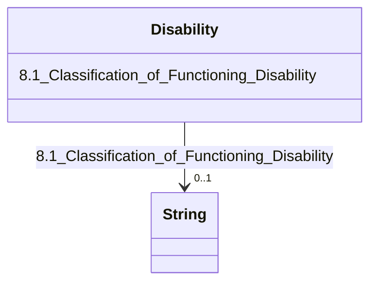

---
search:
  boost: 10.0
---

# Class: Disability 


_8. Disability_


<div data-search-exclude markdown="1">


URI: [rdcdm:Disability](https://github.com/BIH-CEI/rd-cdm/Disability)





<!-- no inheritance hierarchy -->

## Slots

| Name | Cardinality and Range | Description | Inheritance |
| ---  | --- | --- | --- |
| [8.1_Classification_of_Functioning_Disability](8.1_Classification_of_Functioning_Disability.md) | 0..1 <br/> [xsd:string](http://www.w3.org/2001/XMLSchema#string) | Specifies the classification of the individualss functioning or disability ac... | direct |


## Identifier and Mapping Information


### Schema Source


* from schema: https://github.com/BIH-CEI/rd-cdm/linkml/rd_cdm_profile.yaml


## Mappings

| Mapping Type | Mapped Value |
| ---  | ---  |
| self | rdcdm:Disability |
| native | rdcdm:Disability |


## LinkML Source

<!-- TODO: investigate https://stackoverflow.com/questions/37606292/how-to-create-tabbed-code-blocks-in-mkdocs-or-sphinx -->

### Direct

<details>
```yaml
name: Disability
description: 8. Disability
from_schema: https://github.com/BIH-CEI/rd-cdm/linkml/rd_cdm_profile.yaml
slots:
- 8.1 Classification of Functioning Disability

```
</details>

### Induced

<details>
```yaml
name: Disability
description: 8. Disability
from_schema: https://github.com/BIH-CEI/rd-cdm/linkml/rd_cdm_profile.yaml
attributes:
  8.1 Classification of Functioning Disability:
    name: 8.1 Classification of Functioning Disability
    annotations:
      ordinal:
        tag: ordinal
        value: '8.1'
      section:
        tag: section
        value: 8. Disability
      data_type:
        tag: data_type
        value: Code
      data_specification:
        tag: data_specification
        value: ICF
    description: Specifies the classification of the individualss functioning or disability
      according to the International Classification of Functioning, Disability and
      Health (ICF).
    title: 8.1 Classification of Functioning / Disability
    from_schema: https://github.com/BIH-CEI/rd-cdm/linkml/rd_cdm_profile.yaml
    rank: 1000
    slot_uri: CustomCode:icf_score
    alias: 8.1_Classification_of_Functioning_Disability
    owner: Disability
    domain_of:
    - Disability
    range: string

```
</details></div>