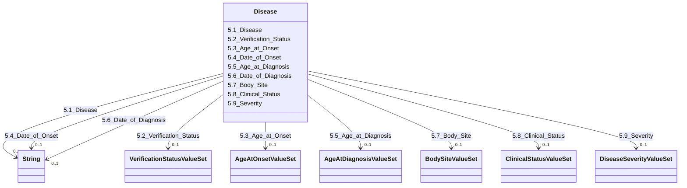

---
search:
  boost: 10.0
---

# Class: Disease 


_5. Disease_


<div data-search-exclude markdown="1">


URI: [rdcdm:Disease](https://github.com/BIH-CEI/rd-cdm/Disease)





<!-- no inheritance hierarchy -->

## Slots

| Name | Cardinality and Range | Description | Inheritance |
| ---  | --- | --- | --- |
| [5.1_Disease](5.1_Disease.md) | 0..1 <br/> [xsd:string](http://www.w3.org/2001/XMLSchema#string) | A disease that the individual was affected by | direct |
| [5.2_Verification_Status](5.2_Verification_Status.md) | 0..1 <br/> [VerificationStatusValueSet](VerificationStatusValueSet.md) | The verification status of the disease | direct |
| [5.3_Age_at_Onset](5.3_Age_at_Onset.md) | 0..1 <br/> [AgeAtOnsetValueSet](AgeAtOnsetValueSet.md) | The age at the onset of the first symptomsor signs of the disease | direct |
| [5.4_Date_of_Onset](5.4_Date_of_Onset.md) | 0..1 <br/> [xsd:string](http://www.w3.org/2001/XMLSchema#string) | The date at onset of first symptoms orsigns of the disease | direct |
| [5.5_Age_at_Diagnosis](5.5_Age_at_Diagnosis.md) | 0..1 <br/> [AgeAtDiagnosisValueSet](AgeAtDiagnosisValueSet.md) | The individual’s age when the diagnosis was made | direct |
| [5.6_Date_of_Diagnosis](5.6_Date_of_Diagnosis.md) | 0..1 <br/> [xsd:string](http://www.w3.org/2001/XMLSchema#string) | The date on which the disease was determined | direct |
| [5.7_Body_Site](5.7_Body_Site.md) | 0..1 <br/> [BodySiteValueSet](BodySiteValueSet.md) | The specific body site affected by disease is encodedusing all descendants of... | direct |
| [5.8_Clinical_Status](5.8_Clinical_Status.md) | 0..1 <br/> [ClinicalStatusValueSet](ClinicalStatusValueSet.md) | The clinical status of the disease indicates whetherit is active, inactive, o... | direct |
| [5.9_Severity](5.9_Severity.md) | 0..1 <br/> [DiseaseSeverityValueSet](DiseaseSeverityValueSet.md) | The severity of the disease is categorised byclinical evaluation | direct |


## Identifier and Mapping Information


### Schema Source


* from schema: https://github.com/BIH-CEI/rd-cdm/linkml/rd_cdm_profile.yaml


## Mappings

| Mapping Type | Mapped Value |
| ---  | ---  |
| self | rdcdm:Disease |
| native | rdcdm:Disease |


## LinkML Source

<!-- TODO: investigate https://stackoverflow.com/questions/37606292/how-to-create-tabbed-code-blocks-in-mkdocs-or-sphinx -->

### Direct

<details>
```yaml
name: Disease
description: 5. Disease
from_schema: https://github.com/BIH-CEI/rd-cdm/linkml/rd_cdm_profile.yaml
slots:
- 5.1 Disease
- 5.2 Verification Status
- 5.3 Age at Onset
- 5.4 Date of Onset
- 5.5 Age at Diagnosis
- 5.6 Date of Diagnosis
- 5.7 Body Site
- 5.8 Clinical Status
- 5.9 Severity

```
</details>

### Induced

<details>
```yaml
name: Disease
description: 5. Disease
from_schema: https://github.com/BIH-CEI/rd-cdm/linkml/rd_cdm_profile.yaml
attributes:
  5.1 Disease:
    name: 5.1 Disease
    annotations:
      ordinal:
        tag: ordinal
        value: '5.1'
      section:
        tag: section
        value: 5. Disease
      data_type:
        tag: data_type
        value: Code
      data_specification:
        tag: data_specification
        value: Ontology Class (MONDO, ORDO, ICD-10, ICD-11, OMIM_g, OMIM_p)
      fhir_expression:
        tag: fhir_expression
        value: Condition.code
      fhir_datatype:
        tag: fhir_datatype
        value: Code
      phenopacket_element:
        tag: phenopacket_element
        value: Disease.term
      phenopacket_datatype:
        tag: phenopacket_datatype
        value: OntologyClass
    description: A disease that the individual was affected by. If agenetic diagnosis
      or subtypes were diagnosed, please also provide the respective OMIM_g and OMIM_p
      codes.
    title: 5.1 Disease
    from_schema: https://github.com/BIH-CEI/rd-cdm/linkml/rd_cdm_profile.yaml
    rank: 1000
    slot_uri: SNOMEDCT:64572001
    alias: 5.1_Disease
    owner: Disease
    domain_of:
    - Disease
    range: string
  5.2 Verification Status:
    name: 5.2 Verification Status
    annotations:
      ordinal:
        tag: ordinal
        value: '5.2'
      section:
        tag: section
        value: 5. Disease
      data_type:
        tag: data_type
        value: Code
      data_specification:
        tag: data_specification
        value: VS
      fhir_expression:
        tag: fhir_expression
        value: Condition.verificationStatus
      fhir_datatype:
        tag: fhir_datatype
        value: 'ValueSet: Condition Verficication Status'
      phenopacket_element:
        tag: phenopacket_element
        value: (Disease.excluded)
      phenopacket_datatype:
        tag: phenopacket_datatype
        value: boolean
    description: The verification status of the disease.
    title: 5.2 Verification Status
    from_schema: https://github.com/BIH-CEI/rd-cdm/linkml/rd_cdm_profile.yaml
    rank: 1000
    slot_uri: LOINC:99498-8
    alias: 5.2_Verification_Status
    owner: Disease
    domain_of:
    - Disease
    range: VerificationStatusValueSet
  5.3 Age at Onset:
    name: 5.3 Age at Onset
    annotations:
      ordinal:
        tag: ordinal
        value: '5.3'
      section:
        tag: section
        value: 5. Disease
      data_type:
        tag: data_type
        value: Code
      data_specification:
        tag: data_specification
        value: VSe, VSc
      fhir_expression:
        tag: fhir_expression
        value: Condition.onsetString orObservation.valueCodeableConcept
      fhir_datatype:
        tag: fhir_datatype
        value: Disease.onset
      phenopacket_element:
        tag: phenopacket_element
        value: Disease.onset
      phenopacket_datatype:
        tag: phenopacket_datatype
        value: Disease.onset
    description: The age at the onset of the first symptomsor signs of the disease.
    title: 5.3 Age at Onset
    from_schema: https://github.com/BIH-CEI/rd-cdm/linkml/rd_cdm_profile.yaml
    rank: 1000
    slot_uri: SNOMEDCT:424850005
    alias: 5.3_Age_at_Onset
    owner: Disease
    domain_of:
    - Disease
    range: AgeAtOnsetValueSet
  5.4 Date of Onset:
    name: 5.4 Date of Onset
    annotations:
      ordinal:
        tag: ordinal
        value: '5.4'
      section:
        tag: section
        value: 5. Disease
      data_type:
        tag: data_type
        value: Date
      data_specification:
        tag: data_specification
        value: YYYY-MM-DD
      fhir_expression:
        tag: fhir_expression
        value: Condition.onset
      fhir_datatype:
        tag: fhir_datatype
        value: DateTime
      phenopacket_element:
        tag: phenopacket_element
        value: Disease.onset
      phenopacket_datatype:
        tag: phenopacket_datatype
        value: TimeElement
    description: The date at onset of first symptoms orsigns of the disease.
    title: 5.4 Date of Onset
    from_schema: https://github.com/BIH-CEI/rd-cdm/linkml/rd_cdm_profile.yaml
    rank: 1000
    slot_uri: SNOMEDCT:298059007
    alias: 5.4_Date_of_Onset
    owner: Disease
    domain_of:
    - Disease
    range: string
  5.5 Age at Diagnosis:
    name: 5.5 Age at Diagnosis
    annotations:
      ordinal:
        tag: ordinal
        value: '5.5'
      section:
        tag: section
        value: 5. Disease
      data_type:
        tag: data_type
        value: Code
      data_specification:
        tag: data_specification
        value: VSe, VSc
      fhir_expression:
        tag: fhir_expression
        value: Observation.value
      fhir_datatype:
        tag: fhir_datatype
        value: CodeableConcept
      phenopacket_element:
        tag: phenopacket_element
        value: (Disease.onset)
      phenopacket_datatype:
        tag: phenopacket_datatype
        value: (TimeElement)
    description: The individual’s age when the diagnosis was made.
    title: 5.5 Age at Diagnosis
    from_schema: https://github.com/BIH-CEI/rd-cdm/linkml/rd_cdm_profile.yaml
    rank: 1000
    slot_uri: SNOMEDCT:423493009
    alias: 5.5_Age_at_Diagnosis
    owner: Disease
    domain_of:
    - Disease
    range: AgeAtDiagnosisValueSet
  5.6 Date of Diagnosis:
    name: 5.6 Date of Diagnosis
    annotations:
      ordinal:
        tag: ordinal
        value: '5.6'
      section:
        tag: section
        value: 5. Disease
      data_type:
        tag: data_type
        value: Date
      data_specification:
        tag: data_specification
        value: YYYY-MM-DD
      fhir_expression:
        tag: fhir_expression
        value: Condition.recordedDate
      fhir_datatype:
        tag: fhir_datatype
        value: DateTime
      phenopacket_element:
        tag: phenopacket_element
        value: (Disease.onset)
      phenopacket_datatype:
        tag: phenopacket_datatype
        value: (TimeElement)
    description: The date on which the disease was determined.
    title: 5.6 Date of Diagnosis
    from_schema: https://github.com/BIH-CEI/rd-cdm/linkml/rd_cdm_profile.yaml
    rank: 1000
    slot_uri: SNOMEDCT:432213005
    alias: 5.6_Date_of_Diagnosis
    owner: Disease
    domain_of:
    - Disease
    range: string
  5.7 Body Site:
    name: 5.7 Body Site
    annotations:
      ordinal:
        tag: ordinal
        value: '5.7'
      section:
        tag: section
        value: 5. Disease
      data_type:
        tag: data_type
        value: Code
      data_specification:
        tag: data_specification
        value: VS
      fhir_expression:
        tag: fhir_expression
        value: Condition.bodySite.coding:SNOMEDCT-ct
      fhir_datatype:
        tag: fhir_datatype
        value: CodeableConcept
      phenopacket_element:
        tag: phenopacket_element
        value: Disease.primary_site
      phenopacket_datatype:
        tag: phenopacket_datatype
        value: OntologyClass
    description: The specific body site affected by disease is encodedusing all descendants
      of SCT Body Structure (123037004).
    title: 5.7 Body Site
    from_schema: https://github.com/BIH-CEI/rd-cdm/linkml/rd_cdm_profile.yaml
    rank: 1000
    slot_uri: SNOMEDCT:363698007
    alias: 5.7_Body_Site
    owner: Disease
    domain_of:
    - Disease
    range: BodySiteValueSet
  5.8 Clinical Status:
    name: 5.8 Clinical Status
    annotations:
      ordinal:
        tag: ordinal
        value: '5.8'
      section:
        tag: section
        value: 5. Disease
      data_type:
        tag: data_type
        value: Code
      data_specification:
        tag: data_specification
        value: VS
      fhir_expression:
        tag: fhir_expression
        value: Condition.clinicalStatus
      fhir_datatype:
        tag: fhir_datatype
        value: 'ValueSet: ClinicalStatus'
    description: The clinical status of the disease indicates whetherit is active,
      inactive, or resolved.
    title: 5.8 Clinical Status
    from_schema: https://github.com/BIH-CEI/rd-cdm/linkml/rd_cdm_profile.yaml
    rank: 1000
    slot_uri: SNOMEDCT:263493007
    alias: 5.8_Clinical_Status
    owner: Disease
    domain_of:
    - Disease
    range: ClinicalStatusValueSet
  5.9 Severity:
    name: 5.9 Severity
    annotations:
      ordinal:
        tag: ordinal
        value: '5.9'
      section:
        tag: section
        value: 5. Disease
      data_type:
        tag: data_type
        value: Code
      data_specification:
        tag: data_specification
        value: VS
      fhir_expression:
        tag: fhir_expression
        value: Condition.severity
      fhir_datatype:
        tag: fhir_datatype
        value: 'ValueSet: ConditionSeverity'
    description: The severity of the disease is categorised byclinical evaluation.
    title: 5.9 Severity
    from_schema: https://github.com/BIH-CEI/rd-cdm/linkml/rd_cdm_profile.yaml
    rank: 1000
    slot_uri: SNOMEDCT:246112005
    alias: 5.9_Severity
    owner: Disease
    domain_of:
    - Disease
    range: DiseaseSeverityValueSet

```
</details></div>