---
search:
  boost: 10.0
---

# Class: FamilyHistory 


_6.4. Family History_


<div data-search-exclude markdown="1">


URI: [rdcdm:FamilyHistory](https://github.com/BIH-CEI/rd-cdm/FamilyHistory)

```mermaid
 classDiagram
    class FamilyHistory
    click FamilyHistory href "../FamilyHistory/"
      FamilyHistory : 6.4.0_Family_Identifier
        
          
    
        
        
        FamilyHistory --> "0..1" String : 6.4.0_Family_Identifier
        click String href "../http://www.w3.org/2001/XMLSchema#string/"
    

        
      FamilyHistory : 6.4.1_Family_Member_Pseudonym
        
          
    
        
        
        FamilyHistory --> "0..1" String : 6.4.1_Family_Member_Pseudonym
        click String href "../http://www.w3.org/2001/XMLSchema#string/"
    

        
      FamilyHistory : 6.4.10_Family_Member_Deceased
        
          
    
        
        
        FamilyHistory --> "0..1" DeceasedValueSet : 6.4.10_Family_Member_Deceased
        click DeceasedValueSet href "../DeceasedValueSet/"
    

        
      FamilyHistory : 6.4.11_Family_Member_Cause_of_Death
        
          
    
        
        
        FamilyHistory --> "0..1" String : 6.4.11_Family_Member_Cause_of_Death
        click String href "../http://www.w3.org/2001/XMLSchema#string/"
    

        
      FamilyHistory : 6.4.12_Family_Member_Deceased_Age
        
          
    
        
        
        FamilyHistory --> "0..1" String : 6.4.12_Family_Member_Deceased_Age
        click String href "../http://www.w3.org/2001/XMLSchema#string/"
    

        
      FamilyHistory : 6.4.13_Family_Member_Disease
        
          
    
        
        
        FamilyHistory --> "0..1" String : 6.4.13_Family_Member_Disease
        click String href "../http://www.w3.org/2001/XMLSchema#string/"
    

        
      FamilyHistory : 6.4.2_Propositus_a
        
          
    
        
        
        FamilyHistory --> "0..1" PropositusValueSet : 6.4.2_Propositus_a
        click PropositusValueSet href "../PropositusValueSet/"
    

        
      FamilyHistory : 6.4.3_Relationship_of_the_Individual_to_the_Propositus
        
          
    
        
        
        FamilyHistory --> "0..1" FamilyRelationshipToIndexCaseValueSet : 6.4.3_Relationship_of_the_Individual_to_the_Propositus
        click FamilyRelationshipToIndexCaseValueSet href "../FamilyRelationshipToIndexCaseValueSet/"
    

        
      FamilyHistory : 6.4.4_Consanguinity
        
          
    
        
        
        FamilyHistory --> "0..1" ConsanguinityValueSet : 6.4.4_Consanguinity
        click ConsanguinityValueSet href "../ConsanguinityValueSet/"
    

        
      FamilyHistory : 6.4.5_Family_Member_Relationship
        
          
    
        
        
        FamilyHistory --> "0..1" FamilyMemberValueSet : 6.4.5_Family_Member_Relationship
        click FamilyMemberValueSet href "../FamilyMemberValueSet/"
    

        
      FamilyHistory : 6.4.6_Family_Member_Record_Status
        
          
    
        
        
        FamilyHistory --> "0..1" FamilyHistoryStatusValueSet : 6.4.6_Family_Member_Record_Status
        click FamilyHistoryStatusValueSet href "../FamilyHistoryStatusValueSet/"
    

        
      FamilyHistory : 6.4.7_Family_Member_Sex
        
          
    
        
        
        FamilyHistory --> "0..1" AdministrativeGenderValueSet : 6.4.7_Family_Member_Sex
        click AdministrativeGenderValueSet href "../AdministrativeGenderValueSet/"
    

        
      FamilyHistory : 6.4.8_Family_Member_Age
        
          
    
        
        
        FamilyHistory --> "0..1" String : 6.4.8_Family_Member_Age
        click String href "../http://www.w3.org/2001/XMLSchema#string/"
    

        
      FamilyHistory : 6.4.9_Family_Member_Date_of_Birth
        
          
    
        
        
        FamilyHistory --> "0..1" String : 6.4.9_Family_Member_Date_of_Birth
        click String href "../http://www.w3.org/2001/XMLSchema#string/"
    

        
      
```





<!-- no inheritance hierarchy -->

## Slots

| Name | Cardinality and Range | Description | Inheritance |
| ---  | --- | --- | --- |
| [6.4.0_Family_Identifier](6.4.0_Family_Identifier.md) | 0..1 <br/> [xsd:string](http://www.w3.org/2001/XMLSchema#string) | An identifier shared by all members of one family, grouping the individual an... | direct |
| [6.4.1_Family_Member_Pseudonym](6.4.1_Family_Member_Pseudonym.md) | 0..1 <br/> [xsd:string](http://www.w3.org/2001/XMLSchema#string) | A unique identifier or local pseudonym for the familymember | direct |
| [6.4.2_Propositus_a](6.4.2_Propositus_a.md) | 0..1 <br/> [PropositusValueSet](PropositusValueSet.md) | Is the individual the first affected family member who seeks medical attentio... | direct |
| [6.4.3_Relationship_of_the_Individual_to_the_Propositus](6.4.3_Relationship_of_the_Individual_to_the_Propositus.md) | 0..1 <br/> [FamilyRelationshipToIndexCaseValueSet](FamilyRelationshipToIndexCaseValueSet.md) | Specifies the familial relationship of the individual being evaluated to the ... | direct |
| [6.4.4_Consanguinity](6.4.4_Consanguinity.md) | 0..1 <br/> [ConsanguinityValueSet](ConsanguinityValueSet.md) | The presence of a biological relationship between parents who are related by ... | direct |
| [6.4.5_Family_Member_Relationship](6.4.5_Family_Member_Relationship.md) | 0..1 <br/> [FamilyMemberValueSet](FamilyMemberValueSet.md) | Specifies the relationship of the selected family member to the patient | direct |
| [6.4.6_Family_Member_Record_Status](6.4.6_Family_Member_Record_Status.md) | 0..1 <br/> [FamilyHistoryStatusValueSet](FamilyHistoryStatusValueSet.md) | Specifies the record’s status of the family history of a specific family memb... | direct |
| [6.4.7_Family_Member_Sex](6.4.7_Family_Member_Sex.md) | 0..1 <br/> [AdministrativeGenderValueSet](AdministrativeGenderValueSet.md) | Specifies the sex (or gender) of the specific family member | direct |
| [6.4.8_Family_Member_Age](6.4.8_Family_Member_Age.md) | 0..1 <br/> [xsd:string](http://www.w3.org/2001/XMLSchema#string) | Records the current age of the selected family member | direct |
| [6.4.9_Family_Member_Date_of_Birth](6.4.9_Family_Member_Date_of_Birth.md) | 0..1 <br/> [xsd:string](http://www.w3.org/2001/XMLSchema#string) | Records the date of birth of the selected family member | direct |
| [6.4.10_Family_Member_Deceased](6.4.10_Family_Member_Deceased.md) | 0..1 <br/> [DeceasedValueSet](DeceasedValueSet.md) | Indicates whether the selected family member is deceased | direct |
| [6.4.11_Family_Member_Cause_of_Death](6.4.11_Family_Member_Cause_of_Death.md) | 0..1 <br/> [xsd:string](http://www.w3.org/2001/XMLSchema#string) | Records the cause of death of the selected deceasedfamily member | direct |
| [6.4.12_Family_Member_Deceased_Age](6.4.12_Family_Member_Deceased_Age.md) | 0..1 <br/> [xsd:string](http://www.w3.org/2001/XMLSchema#string) | Records the age at which the selected family member died | direct |
| [6.4.13_Family_Member_Disease](6.4.13_Family_Member_Disease.md) | 0..1 <br/> [xsd:string](http://www.w3.org/2001/XMLSchema#string) | Indicates whether the selected family member is affected by the same rare dis... | direct |


## Identifier and Mapping Information


### Schema Source


* from schema: https://github.com/BIH-CEI/rd-cdm/linkml/rd_cdm_profile.yaml


## Mappings

| Mapping Type | Mapped Value |
| ---  | ---  |
| self | rdcdm:FamilyHistory |
| native | rdcdm:FamilyHistory |


## LinkML Source

<!-- TODO: investigate https://stackoverflow.com/questions/37606292/how-to-create-tabbed-code-blocks-in-mkdocs-or-sphinx -->

### Direct

<details>
```yaml
name: FamilyHistory
description: 6.4. Family History
from_schema: https://github.com/BIH-CEI/rd-cdm/linkml/rd_cdm_profile.yaml
slots:
- 6.4.0 Family Identifier
- 6.4.1 Family Member Pseudonym
- 6.4.2 Propositus-a
- 6.4.3 Relationship of the Individual to the Propositus
- 6.4.4 Consanguinity
- 6.4.5 Family Member Relationship
- 6.4.6 Family Member Record Status
- 6.4.7 Family Member Sex
- 6.4.8 Family Member Age
- 6.4.9 Family Member Date of Birth
- 6.4.10 Family Member Deceased
- 6.4.11 Family Member Cause of Death
- 6.4.12 Family Member Deceased Age
- 6.4.13 Family Member Disease

```
</details>

### Induced

<details>
```yaml
name: FamilyHistory
description: 6.4. Family History
from_schema: https://github.com/BIH-CEI/rd-cdm/linkml/rd_cdm_profile.yaml
attributes:
  6.4.0 Family Identifier:
    name: 6.4.0 Family Identifier
    annotations:
      ordinal:
        tag: ordinal
        value: 6.4.0
      section:
        tag: section
        value: 6.4 Family History
      data_type:
        tag: data_type
        value: Identifier
      fhir_expression:
        tag: fhir_expression
        value: Group.identifier
      fhir_datatype:
        tag: fhir_datatype
        value: Identifier
      phenopacket_element:
        tag: phenopacket_element
        value: Family.id
      phenopacket_datatype:
        tag: phenopacket_datatype
        value: string
    description: An identifier shared by all members of one family, grouping the individual
      and their relatives into a single family record. Distinct from 6.4.1, which
      identifies a single family member.
    title: 6.4.0 Family Identifier
    from_schema: https://github.com/BIH-CEI/rd-cdm/linkml/rd_cdm_profile.yaml
    rank: 1000
    slot_uri: GA4GH:family.id
    alias: 6.4.0_Family_Identifier
    owner: FamilyHistory
    domain_of:
    - FamilyHistory
    range: string
  6.4.1 Family Member Pseudonym:
    name: 6.4.1 Family Member Pseudonym
    annotations:
      ordinal:
        tag: ordinal
        value: 6.4.1
      section:
        tag: section
        value: 6.4 Family History
      data_type:
        tag: data_type
        value: Identifier
      fhir_expression:
        tag: fhir_expression
        value: FamilyMemberHistory.identifier
      fhir_datatype:
        tag: fhir_datatype
        value: Identifier
      phenopacket_element:
        tag: phenopacket_element
        value: Family.Pedigree.Person.individual_id
      phenopacket_datatype:
        tag: phenopacket_datatype
        value: string
    description: A unique identifier or local pseudonym for the familymember.
    title: 6.4.1 Family Member Pseudonym
    from_schema: https://github.com/BIH-CEI/rd-cdm/linkml/rd_cdm_profile.yaml
    rank: 1000
    slot_uri: CustomCode:family_member_id
    alias: 6.4.1_Family_Member_Pseudonym
    owner: FamilyHistory
    domain_of:
    - FamilyHistory
    range: string
  6.4.2 Propositus-a:
    name: 6.4.2 Propositus-a
    annotations:
      ordinal:
        tag: ordinal
        value: 6.4.2
      section:
        tag: section
        value: 6.4 Family History
      data_type:
        tag: data_type
        value: Code
      data_specification:
        tag: data_specification
        value: VSe, VSc
      phenopacket_element:
        tag: phenopacket_element
        value: (Family.relatives → 1 Phenopacket per family member)
      phenopacket_datatype:
        tag: phenopacket_datatype
        value: (Family.relatives → 1 Phenopacket per family member)
    description: 'Is the individual the first affected family member who seeks medical
      attention for a genetic disorder, leading to the diagnosis of other family members.
      Disclaimer: The SCT code for propositus (64245008) refers to any  gender.'
    title: 6.4.2 Propositus/-a
    from_schema: https://github.com/BIH-CEI/rd-cdm/linkml/rd_cdm_profile.yaml
    rank: 1000
    slot_uri: SNOMEDCT:64245008
    alias: 6.4.2_Propositus_a
    owner: FamilyHistory
    domain_of:
    - FamilyHistory
    range: PropositusValueSet
  6.4.3 Relationship of the Individual to the Propositus:
    name: 6.4.3 Relationship of the Individual to the Propositus
    annotations:
      ordinal:
        tag: ordinal
        value: 6.4.3
      section:
        tag: section
        value: 6.4 Family History
      data_type:
        tag: data_type
        value: Code
      data_specification:
        tag: data_specification
        value: VSe, VSc
      phenopacket_element:
        tag: phenopacket_element
        value: (Family.relatives → 1 Phenopacket per family member)
      phenopacket_datatype:
        tag: phenopacket_datatype
        value: (Family.relatives → 1 Phenopacket per family member)
    description: 'Specifies the familial relationship of the individual being evaluated
      to the propositus. Disclaimer: The SNOMEDCT code for propositus (64245008) refers
      to any gender.'
    title: 6.4.3 Relationship of the Individual to the Propositus
    from_schema: https://github.com/BIH-CEI/rd-cdm/linkml/rd_cdm_profile.yaml
    rank: 1000
    slot_uri: SNOMEDCT:408732007
    alias: 6.4.3_Relationship_of_the_Individual_to_the_Propositus
    owner: FamilyHistory
    domain_of:
    - FamilyHistory
    range: FamilyRelationshipToIndexCaseValueSet
  6.4.4 Consanguinity:
    name: 6.4.4 Consanguinity
    annotations:
      ordinal:
        tag: ordinal
        value: 6.4.4
      section:
        tag: section
        value: 6.4 Family History
      data_type:
        tag: data_type
        value: Code
      data_specification:
        tag: data_specification
        value: VSe
      phenopacket_element:
        tag: phenopacket_element
        value: Family.consanguinous_parents
      phenopacket_datatype:
        tag: phenopacket_datatype
        value: boolean
    description: The presence of a biological relationship between parents who are
      related by blood, typically as first or second cousins.
    title: 6.4.4 Consanguinity
    from_schema: https://github.com/BIH-CEI/rd-cdm/linkml/rd_cdm_profile.yaml
    rank: 1000
    slot_uri: SNOMEDCT:842009
    alias: 6.4.4_Consanguinity
    owner: FamilyHistory
    domain_of:
    - FamilyHistory
    range: ConsanguinityValueSet
  6.4.5 Family Member Relationship:
    name: 6.4.5 Family Member Relationship
    annotations:
      ordinal:
        tag: ordinal
        value: 6.4.5
      section:
        tag: section
        value: 6.4 Family History
      data_type:
        tag: data_type
        value: Code
      data_specification:
        tag: data_specification
        value: VSe, VSc
      fhir_expression:
        tag: fhir_expression
        value: FamilyMemberHistory.relationship.coding
      fhir_datatype:
        tag: fhir_datatype
        value: 'ValueSet: FamilyMember'
      phenopacket_element:
        tag: phenopacket_element
        value: Family.Pedigree.Person.individual_id
      phenopacket_datatype:
        tag: phenopacket_datatype
        value: string
    description: Specifies the relationship of the selected family member to the patient.
    title: 6.4.5 Family Member Relationship
    from_schema: https://github.com/BIH-CEI/rd-cdm/linkml/rd_cdm_profile.yaml
    rank: 1000
    slot_uri: SNOMEDCT:444018008
    alias: 6.4.5_Family_Member_Relationship
    owner: FamilyHistory
    domain_of:
    - FamilyHistory
    range: FamilyMemberValueSet
  6.4.6 Family Member Record Status:
    name: 6.4.6 Family Member Record Status
    annotations:
      ordinal:
        tag: ordinal
        value: 6.4.6
      section:
        tag: section
        value: 6.4 Family History
      data_type:
        tag: data_type
        value: Code
      data_specification:
        tag: data_specification
        value: VS
      fhir_expression:
        tag: fhir_expression
        value: FamilyMemberHistory.status
    description: Specifies the record’s status of the family history of a specific
      family member.
    title: 6.4.6 Family Member Record Status
    from_schema: https://github.com/BIH-CEI/rd-cdm/linkml/rd_cdm_profile.yaml
    rank: 1000
    slot_uri: HL7FHIR:familymemberhistory.status
    alias: 6.4.6_Family_Member_Record_Status
    owner: FamilyHistory
    domain_of:
    - FamilyHistory
    range: FamilyHistoryStatusValueSet
  6.4.7 Family Member Sex:
    name: 6.4.7 Family Member Sex
    annotations:
      ordinal:
        tag: ordinal
        value: 6.4.7
      section:
        tag: section
        value: 6.4 Family History
      data_type:
        tag: data_type
        value: Code
      data_specification:
        tag: data_specification
        value: VSe, VSc
      fhir_expression:
        tag: fhir_expression
        value: FamilyMemberHistory.sex
      fhir_datatype:
        tag: fhir_datatype
        value: 'ValueSet: AdministrativeGender'
      phenopacket_element:
        tag: phenopacket_element
        value: Family.Pedigree.Person.sex
      phenopacket_datatype:
        tag: phenopacket_datatype
        value: 'ValueSet: Sex'
    description: Specifies the sex (or gender) of the specific family member. If possible,
      the sex assigned at birth should be selected.
    title: 6.4.7 Family Member Sex
    from_schema: https://github.com/BIH-CEI/rd-cdm/linkml/rd_cdm_profile.yaml
    rank: 1000
    slot_uri: LOINC:54123-5
    alias: 6.4.7_Family_Member_Sex
    owner: FamilyHistory
    domain_of:
    - FamilyHistory
    range: AdministrativeGenderValueSet
  6.4.8 Family Member Age:
    name: 6.4.8 Family Member Age
    annotations:
      ordinal:
        tag: ordinal
        value: 6.4.8
      section:
        tag: section
        value: 6.4 Family History
      data_type:
        tag: data_type
        value: Integer
      data_specification:
        tag: data_specification
        value: Integer
      fhir_expression:
        tag: fhir_expression
        value: FamilyMemberHistory.ageAge
      fhir_datatype:
        tag: fhir_datatype
        value: Age
      phenopacket_element:
        tag: phenopacket_element
        value: (Family.relatives → 1 Phenopacket per family member)
      phenopacket_datatype:
        tag: phenopacket_datatype
        value: (Family.relatives → 1 Phenopacket per family member)
    description: Records the current age of the selected family member.
    title: 6.4.8 Family Member Age
    from_schema: https://github.com/BIH-CEI/rd-cdm/linkml/rd_cdm_profile.yaml
    rank: 1000
    slot_uri: LOINC:54141-7
    alias: 6.4.8_Family_Member_Age
    owner: FamilyHistory
    domain_of:
    - FamilyHistory
    range: string
  6.4.9 Family Member Date of Birth:
    name: 6.4.9 Family Member Date of Birth
    annotations:
      ordinal:
        tag: ordinal
        value: 6.4.9
      section:
        tag: section
        value: 6.4 Family History
      data_type:
        tag: data_type
        value: Date
      data_specification:
        tag: data_specification
        value: YYYY-MM-DD
      fhir_expression:
        tag: fhir_expression
        value: FamilyMemberHistory.bornDate
      fhir_datatype:
        tag: fhir_datatype
        value: DateTime
      phenopacket_element:
        tag: phenopacket_element
        value: (Family.relatives → 1 Phenopacket per family member)
      phenopacket_datatype:
        tag: phenopacket_datatype
        value: (Family.relatives → 1 Phenopacket per family member)
    description: Records the date of birth of the selected family member.
    title: 6.4.9 Family Member Date of Birth
    from_schema: https://github.com/BIH-CEI/rd-cdm/linkml/rd_cdm_profile.yaml
    rank: 1000
    slot_uri: LOINC:54124-3
    alias: 6.4.9_Family_Member_Date_of_Birth
    owner: FamilyHistory
    domain_of:
    - FamilyHistory
    range: string
  6.4.10 Family Member Deceased:
    name: 6.4.10 Family Member Deceased
    annotations:
      ordinal:
        tag: ordinal
        value: 6.4.10
      section:
        tag: section
        value: 6.4 Family History
      data_type:
        tag: data_type
        value: Code
      data_specification:
        tag: data_specification
        value: VSe
      fhir_expression:
        tag: fhir_expression
        value: FamilyMemberHistory.deceased.deceasedBoolean
      fhir_datatype:
        tag: fhir_datatype
        value: boolean
      phenopacket_element:
        tag: phenopacket_element
        value: (Family.relatives → 1 Phenopacket per family member)
      phenopacket_datatype:
        tag: phenopacket_datatype
        value: (Family.relatives → 1 Phenopacket per family member)
    description: Indicates whether the selected family member is deceased.
    title: 6.4.10 Family Member Deceased
    from_schema: https://github.com/BIH-CEI/rd-cdm/linkml/rd_cdm_profile.yaml
    rank: 1000
    slot_uri: SNOMEDCT:740604001
    alias: 6.4.10_Family_Member_Deceased
    owner: FamilyHistory
    domain_of:
    - FamilyHistory
    range: DeceasedValueSet
  6.4.11 Family Member Cause of Death:
    name: 6.4.11 Family Member Cause of Death
    annotations:
      ordinal:
        tag: ordinal
        value: 6.4.11
      section:
        tag: section
        value: 6.4 Family History
      data_type:
        tag: data_type
        value: Code
      data_specification:
        tag: data_specification
        value: ICD10CM
      fhir_expression:
        tag: fhir_expression
        value: FamilyMemberHistory.condition.code & FamilyMemberHistory.condition.contributedToDeath
      fhir_datatype:
        tag: fhir_datatype
        value: Code
      phenopacket_element:
        tag: phenopacket_element
        value: (Family.relatives → 1 Phenopacket per family member)
      phenopacket_datatype:
        tag: phenopacket_datatype
        value: (Family.relatives → 1 Phenopacket per family member)
    description: Records the cause of death of the selected deceasedfamily member.
    title: 6.4.11 Family Member Cause of Death
    from_schema: https://github.com/BIH-CEI/rd-cdm/linkml/rd_cdm_profile.yaml
    rank: 1000
    slot_uri: LOINC:54112-8
    alias: 6.4.11_Family_Member_Cause_of_Death
    owner: FamilyHistory
    domain_of:
    - FamilyHistory
    range: string
  6.4.12 Family Member Deceased Age:
    name: 6.4.12 Family Member Deceased Age
    annotations:
      ordinal:
        tag: ordinal
        value: 6.4.12
      section:
        tag: section
        value: 6.4 Family History
      data_type:
        tag: data_type
        value: Integer
      data_specification:
        tag: data_specification
        value: Integer
      fhir_expression:
        tag: fhir_expression
        value: FamilyMemberHistory.deceasedAge
      fhir_datatype:
        tag: fhir_datatype
        value: Family.relatives
      phenopacket_element:
        tag: phenopacket_element
        value: Family.relatives
      phenopacket_datatype:
        tag: phenopacket_datatype
        value: Family.relatives
    description: Records the age at which the selected family member died.
    title: 6.4.12 Family Member Deceased Age
    from_schema: https://github.com/BIH-CEI/rd-cdm/linkml/rd_cdm_profile.yaml
    rank: 1000
    slot_uri: LOINC:92662-6
    alias: 6.4.12_Family_Member_Deceased_Age
    owner: FamilyHistory
    domain_of:
    - FamilyHistory
    range: string
  6.4.13 Family Member Disease:
    name: 6.4.13 Family Member Disease
    annotations:
      ordinal:
        tag: ordinal
        value: 6.4.13
      section:
        tag: section
        value: 6.4 Family History
      data_type:
        tag: data_type
        value: Code
      data_specification:
        tag: data_specification
        value: Ontology Class, ORDO, ICD-10-CM, ICD-11, MONDO, OMIM_p
      fhir_expression:
        tag: fhir_expression
        value: FamilyMemberHistory.condition.code
      fhir_datatype:
        tag: fhir_datatype
        value: Family.relatives
      phenopacket_element:
        tag: phenopacket_element
        value: Family.relatives
      phenopacket_datatype:
        tag: phenopacket_datatype
        value: Family.relatives
    description: Indicates whether the selected family member is affected by the same
      rare disease as the individual.
    title: 6.4.13 Family Member Disease
    from_schema: https://github.com/BIH-CEI/rd-cdm/linkml/rd_cdm_profile.yaml
    rank: 1000
    slot_uri: LOINC:75315-2
    alias: 6.4.13_Family_Member_Disease
    owner: FamilyHistory
    domain_of:
    - FamilyHistory
    range: string

```
</details></div>