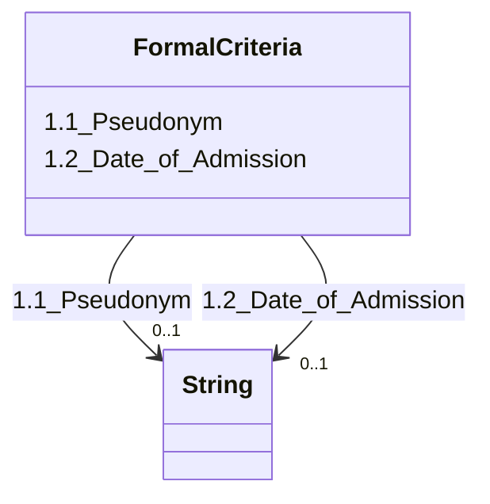

---
search:
  boost: 10.0
---

# Class: FormalCriteria 


_1. Formal Criteria_


<div data-search-exclude markdown="1">


URI: [rdcdm:FormalCriteria](https://github.com/BIH-CEI/rd-cdm/FormalCriteria)





<!-- no inheritance hierarchy -->

## Slots

| Name | Cardinality and Range | Description | Inheritance |
| ---  | --- | --- | --- |
| [1.1_Pseudonym](1.1_Pseudonym.md) | 0..1 <br/> [xsd:string](http://www.w3.org/2001/XMLSchema#string) | The (local) patient-related identification code | direct |
| [1.2_Date_of_Admission](1.2_Date_of_Admission.md) | 0..1 <br/> [xsd:string](http://www.w3.org/2001/XMLSchema#string) | The date of admission or data capture of the individual | direct |


## Identifier and Mapping Information


### Schema Source


* from schema: https://github.com/BIH-CEI/rd-cdm/linkml/rd_cdm_profile.yaml


## Mappings

| Mapping Type | Mapped Value |
| ---  | ---  |
| self | rdcdm:FormalCriteria |
| native | rdcdm:FormalCriteria |


## LinkML Source

<!-- TODO: investigate https://stackoverflow.com/questions/37606292/how-to-create-tabbed-code-blocks-in-mkdocs-or-sphinx -->

### Direct

<details>
```yaml
name: FormalCriteria
description: 1. Formal Criteria
from_schema: https://github.com/BIH-CEI/rd-cdm/linkml/rd_cdm_profile.yaml
slots:
- 1.1 Pseudonym
- 1.2 Date of Admission

```
</details>

### Induced

<details>
```yaml
name: FormalCriteria
description: 1. Formal Criteria
from_schema: https://github.com/BIH-CEI/rd-cdm/linkml/rd_cdm_profile.yaml
attributes:
  1.1 Pseudonym:
    name: 1.1 Pseudonym
    annotations:
      ordinal:
        tag: ordinal
        value: '1.1'
      section:
        tag: section
        value: 1. Formal Criteria
      data_type:
        tag: data_type
        value: Identifier
      fhir_expression:
        tag: fhir_expression
        value: Patient.identifier.value
      phenopacket_element:
        tag: phenopacket_element
        value: Individual.id
      phenopacket_datatype:
        tag: phenopacket_datatype
        value: string
    description: The (local) patient-related identification code.
    title: 1.1 Pseudonym
    from_schema: https://github.com/BIH-CEI/rd-cdm/linkml/rd_cdm_profile.yaml
    rank: 1000
    slot_uri: SNOMEDCT:422549004
    alias: 1.1_Pseudonym
    owner: FormalCriteria
    domain_of:
    - FormalCriteria
    range: string
  1.2 Date of Admission:
    name: 1.2 Date of Admission
    annotations:
      ordinal:
        tag: ordinal
        value: '1.2'
      section:
        tag: section
        value: 1. Formal Criteria
      data_type:
        tag: data_type
        value: Date
      data_specification:
        tag: data_specification
        value: YYYY-MM-DD
      fhir_expression:
        tag: fhir_expression
        value: Encounter.period.start
      phenopacket_element:
        tag: phenopacket_element
        value: Individual.time_at_last_encounter
      phenopacket_datatype:
        tag: phenopacket_datatype
        value: TimeElement
    description: The date of admission or data capture of the individual.
    title: 1.2 Date of Admission
    from_schema: https://github.com/BIH-CEI/rd-cdm/linkml/rd_cdm_profile.yaml
    rank: 1000
    slot_uri: SNOMEDCT:399423000
    alias: 1.2_Date_of_Admission
    owner: FormalCriteria
    domain_of:
    - FormalCriteria
    range: string

```
</details></div>