---
search:
  boost: 10.0
---

# Class: GeneticFindings 


_6.1. Genetic Findings_


<div data-search-exclude markdown="1">


URI: [rdcdm:GeneticFindings](https://github.com/BIH-CEI/rd-cdm/GeneticFindings)

```mermaid
 classDiagram
    class GeneticFindings
    click GeneticFindings href "../GeneticFindings/"
      GeneticFindings : 6.1.1_Genomic_Diagnosis
        
          
    
        
        
        GeneticFindings --> "0..1" String : 6.1.1_Genomic_Diagnosis
        click String href "../http://www.w3.org/2001/XMLSchema#string/"
    

        
      GeneticFindings : 6.1.10_Gene
        
          
    
        
        
        GeneticFindings --> "0..1" String : 6.1.10_Gene
        click String href "../http://www.w3.org/2001/XMLSchema#string/"
    

        
      GeneticFindings : 6.1.11_Zygosity
        
          
    
        
        
        GeneticFindings --> "0..1" ZygosityValueSet : 6.1.11_Zygosity
        click ZygosityValueSet href "../ZygosityValueSet/"
    

        
      GeneticFindings : 6.1.12_Genomic_Source_Class
        
          
    
        
        
        GeneticFindings --> "0..1" GenomicSourceClassValueSet : 6.1.12_Genomic_Source_Class
        click GenomicSourceClassValueSet href "../GenomicSourceClassValueSet/"
    

        
      GeneticFindings : 6.1.13_DNA_Change_Type
        
          
    
        
        
        GeneticFindings --> "0..1" DNAChangeTypeValueSet : 6.1.13_DNA_Change_Type
        click DNAChangeTypeValueSet href "../DNAChangeTypeValueSet/"
    

        
      GeneticFindings : 6.1.14_Clinical_Significance_ACMG
        
          
    
        
        
        GeneticFindings --> "0..1" ClinicalSignificanceACMGValueSet : 6.1.14_Clinical_Significance_ACMG
        click ClinicalSignificanceACMGValueSet href "../ClinicalSignificanceACMGValueSet/"
    

        
      GeneticFindings : 6.1.15_Therapeutic_Actionability
        
          
    
        
        
        GeneticFindings --> "0..1" TherapeuticActionabilityValueSet : 6.1.15_Therapeutic_Actionability
        click TherapeuticActionabilityValueSet href "../TherapeuticActionabilityValueSet/"
    

        
      GeneticFindings : 6.1.16_Clinical_Annotation_Level_Of_Evidence
        
          
    
        
        
        GeneticFindings --> "0..1" ClinicalAnnotationLevelOfEvidenceValueSet : 6.1.16_Clinical_Annotation_Level_Of_Evidence
        click ClinicalAnnotationLevelOfEvidenceValueSet href "../ClinicalAnnotationLevelOfEvidenceValueSet/"
    

        
      GeneticFindings : 6.1.2_Progress_Status_of_Interpretation
        
          
    
        
        
        GeneticFindings --> "0..1" ProgressStatusValueSet : 6.1.2_Progress_Status_of_Interpretation
        click ProgressStatusValueSet href "../ProgressStatusValueSet/"
    

        
      GeneticFindings : 6.1.3_Interpretation_Status
        
          
    
        
        
        GeneticFindings --> "0..1" InterpretationStatusValueSet : 6.1.3_Interpretation_Status
        click InterpretationStatusValueSet href "../InterpretationStatusValueSet/"
    

        
      GeneticFindings : 6.1.4_Structural_Variant_Analysis_Method
        
          
    
        
        
        GeneticFindings --> "0..1" StructuralVariantAnalysisMethodValueSet : 6.1.4_Structural_Variant_Analysis_Method
        click StructuralVariantAnalysisMethodValueSet href "../StructuralVariantAnalysisMethodValueSet/"
    

        
      GeneticFindings : 6.1.5_Reference_Genome
        
          
    
        
        
        GeneticFindings --> "0..1" ReferenceGenomeValueSet : 6.1.5_Reference_Genome
        click ReferenceGenomeValueSet href "../ReferenceGenomeValueSet/"
    

        
      GeneticFindings : 6.1.6_Genetic_Mutation_String
        
          
    
        
        
        GeneticFindings --> "0..1" String : 6.1.6_Genetic_Mutation_String
        click String href "../http://www.w3.org/2001/XMLSchema#string/"
    

        
      GeneticFindings : 6.1.7_Genomic_DNA_Change
        
          
    
        
        
        GeneticFindings --> "0..1" String : 6.1.7_Genomic_DNA_Change
        click String href "../http://www.w3.org/2001/XMLSchema#string/"
    

        
      GeneticFindings : 6.1.8_Sequence_DNA_Change
        
          
    
        
        
        GeneticFindings --> "0..1" String : 6.1.8_Sequence_DNA_Change
        click String href "../http://www.w3.org/2001/XMLSchema#string/"
    

        
      GeneticFindings : 6.1.9_Amino_Acid_Change
        
          
    
        
        
        GeneticFindings --> "0..1" String : 6.1.9_Amino_Acid_Change
        click String href "../http://www.w3.org/2001/XMLSchema#string/"
    

        
      
```





<!-- no inheritance hierarchy -->

## Slots

| Name | Cardinality and Range | Description | Inheritance |
| ---  | --- | --- | --- |
| [6.1.1_Genomic_Diagnosis](6.1.1_Genomic_Diagnosis.md) | 0..1 <br/> [xsd:string](http://www.w3.org/2001/XMLSchema#string) | The genomic diagnoses can correspond to the diagnoseddisease in (5 | direct |
| [6.1.2_Progress_Status_of_Interpretation](6.1.2_Progress_Status_of_Interpretation.md) | 0..1 <br/> [ProgressStatusValueSet](ProgressStatusValueSet.md) | The interpretation has a ProgressStatus that refers tothe status of the attem... | direct |
| [6.1.3_Interpretation_Status](6.1.3_Interpretation_Status.md) | 0..1 <br/> [InterpretationStatusValueSet](InterpretationStatusValueSet.md) | An enumeration that describes the conclusion made about the genomic interpret... | direct |
| [6.1.4_Structural_Variant_Analysis_Method](6.1.4_Structural_Variant_Analysis_Method.md) | 0..1 <br/> [StructuralVariantAnalysisMethodValueSet](StructuralVariantAnalysisMethodValueSet.md) | The method used to analyse structural variants in the genome | direct |
| [6.1.5_Reference_Genome](6.1.5_Reference_Genome.md) | 0..1 <br/> [ReferenceGenomeValueSet](ReferenceGenomeValueSet.md) | The reference genome used for analysing the genetic variant | direct |
| [6.1.6_Genetic_Mutation_String](6.1.6_Genetic_Mutation_String.md) | 0..1 <br/> [xsd:string](http://www.w3.org/2001/XMLSchema#string) | An unvalidated (HGVS) string that describes the variant change | direct |
| [6.1.7_Genomic_DNA_Change](6.1.7_Genomic_DNA_Change.md) | 0..1 <br/> [xsd:string](http://www.w3.org/2001/XMLSchema#string) | The specific change in the genomic DNA sequence encoded with a validated g | direct |
| [6.1.8_Sequence_DNA_Change](6.1.8_Sequence_DNA_Change.md) | 0..1 <br/> [xsd:string](http://www.w3.org/2001/XMLSchema#string) | The specific change in the DNA sequence at the nucleotide level with a valida... | direct |
| [6.1.9_Amino_Acid_Change](6.1.9_Amino_Acid_Change.md) | 0..1 <br/> [xsd:string](http://www.w3.org/2001/XMLSchema#string) | The specific change in the amino acid sequence resulting from agenetic varian... | direct |
| [6.1.10_Gene](6.1.10_Gene.md) | 0..1 <br/> [xsd:string](http://www.w3.org/2001/XMLSchema#string) | The specific gene or genes that were analysed or identified in the study | direct |
| [6.1.11_Zygosity](6.1.11_Zygosity.md) | 0..1 <br/> [ZygosityValueSet](ZygosityValueSet.md) | The zygosity of the genetic variant | direct |
| [6.1.12_Genomic_Source_Class](6.1.12_Genomic_Source_Class.md) | 0..1 <br/> [GenomicSourceClassValueSet](GenomicSourceClassValueSet.md) | The classification of the genomic source, such as germline, somatic, or other... | direct |
| [6.1.13_DNA_Change_Type](6.1.13_DNA_Change_Type.md) | 0..1 <br/> [DNAChangeTypeValueSet](DNAChangeTypeValueSet.md) | The variant’s type of DNA change, such as point mutation, deletion, insertion... | direct |
| [6.1.14_Clinical_Significance_ACMG](6.1.14_Clinical_Significance_ACMG.md) | 0..1 <br/> [ClinicalSignificanceACMGValueSet](ClinicalSignificanceACMGValueSet.md) | The clinical significance of the genetic variant, indicating its impact on he... | direct |
| [6.1.15_Therapeutic_Actionability](6.1.15_Therapeutic_Actionability.md) | 0..1 <br/> [TherapeuticActionabilityValueSet](TherapeuticActionabilityValueSet.md) | An enumeration flagging the variant as being a candidate for treatment or cli... | direct |
| [6.1.16_Clinical_Annotation_Level_Of_Evidence](6.1.16_Clinical_Annotation_Level_Of_Evidence.md) | 0..1 <br/> [ClinicalAnnotationLevelOfEvidenceValueSet](ClinicalAnnotationLevelOfEvidenceValueSet.md) | The level of evidence supporting the clinical annotation of the genetic varia... | direct |


## Identifier and Mapping Information


### Schema Source


* from schema: https://github.com/BIH-CEI/rd-cdm/linkml/rd_cdm_profile.yaml


## Mappings

| Mapping Type | Mapped Value |
| ---  | ---  |
| self | rdcdm:GeneticFindings |
| native | rdcdm:GeneticFindings |


## LinkML Source

<!-- TODO: investigate https://stackoverflow.com/questions/37606292/how-to-create-tabbed-code-blocks-in-mkdocs-or-sphinx -->

### Direct

<details>
```yaml
name: GeneticFindings
description: 6.1. Genetic Findings
from_schema: https://github.com/BIH-CEI/rd-cdm/linkml/rd_cdm_profile.yaml
slots:
- 6.1.1 Genomic Diagnosis
- 6.1.2 Progress Status of Interpretation
- 6.1.3 Interpretation Status
- 6.1.4 Structural Variant Analysis Method
- 6.1.5 Reference Genome
- 6.1.6 Genetic Mutation String
- 6.1.7 Genomic DNA Change
- 6.1.8 Sequence DNA Change
- 6.1.9 Amino Acid Change
- 6.1.10 Gene
- 6.1.11 Zygosity
- 6.1.12 Genomic Source Class
- 6.1.13 DNA Change Type
- 6.1.14 Clinical Significance ACMG
- 6.1.15 Therapeutic Actionability
- 6.1.16 Clinical Annotation Level Of Evidence

```
</details>

### Induced

<details>
```yaml
name: GeneticFindings
description: 6.1. Genetic Findings
from_schema: https://github.com/BIH-CEI/rd-cdm/linkml/rd_cdm_profile.yaml
attributes:
  6.1.1 Genomic Diagnosis:
    name: 6.1.1 Genomic Diagnosis
    annotations:
      ordinal:
        tag: ordinal
        value: 6.1.1
      section:
        tag: section
        value: 6.1 Genetic Findings
      data_type:
        tag: data_type
        value: Code
      data_specification:
        tag: data_specification
        value: OMIM_p, MONDO
      fhir_expression:
        tag: fhir_expression
        value: Condition.code
      fhir_datatype:
        tag: fhir_datatype
        value: Code
      phenopacket_element:
        tag: phenopacket_element
        value: Interpretation.Diagnosis.disease
      phenopacket_datatype:
        tag: phenopacket_datatype
        value: OntologyClass
    description: The genomic diagnoses can correspond to the diagnoseddisease in (5.1)
      if the same OMIM codes are used.
    title: 6.1.1 Genomic Diagnosis
    from_schema: https://github.com/BIH-CEI/rd-cdm/linkml/rd_cdm_profile.yaml
    rank: 1000
    slot_uri: SNOMEDCT:106221001
    alias: 6.1.1_Genomic_Diagnosis
    owner: GeneticFindings
    domain_of:
    - GeneticFindings
    range: string
  6.1.2 Progress Status of Interpretation:
    name: 6.1.2 Progress Status of Interpretation
    annotations:
      ordinal:
        tag: ordinal
        value: 6.1.2
      section:
        tag: section
        value: 6.1 Genetic Findings
      data_type:
        tag: data_type
        value: Code
      data_specification:
        tag: data_specification
        value: VS
      fhir_expression:
        tag: fhir_expression
        value: Condition.extension
      fhir_datatype:
        tag: fhir_datatype
        value: 'VS: GA4GH ProgressStatus'
      phenopacket_element:
        tag: phenopacket_element
        value: Interpretation.progress_status
      phenopacket_datatype:
        tag: phenopacket_datatype
        value: 'ValueSet: ProgressStatus'
    description: The interpretation has a ProgressStatus that refers tothe status
      of the attempted diagnosis.
    title: 6.1.2 Progress Status of Interpretation
    from_schema: https://github.com/BIH-CEI/rd-cdm/linkml/rd_cdm_profile.yaml
    rank: 1000
    slot_uri: GA4GH:progress_status
    alias: 6.1.2_Progress_Status_of_Interpretation
    owner: GeneticFindings
    domain_of:
    - GeneticFindings
    range: ProgressStatusValueSet
  6.1.3 Interpretation Status:
    name: 6.1.3 Interpretation Status
    annotations:
      ordinal:
        tag: ordinal
        value: 6.1.3
      section:
        tag: section
        value: 6.1 Genetic Findings
      data_type:
        tag: data_type
        value: Code
      data_specification:
        tag: data_specification
        value: VS
      fhir_expression:
        tag: fhir_expression
        value: Condition.extension
      fhir_datatype:
        tag: fhir_datatype
        value: 'VS: GA4GH InterpretationStatus'
      phenopacket_element:
        tag: phenopacket_element
        value: GenomicInterpretation.interpretation_status
      phenopacket_datatype:
        tag: phenopacket_datatype
        value: 'ValueSet: InterpretationStatus'
    description: An enumeration that describes the conclusion made about the genomic
      interpretation.
    title: 6.1.3 Interpretation Status
    from_schema: https://github.com/BIH-CEI/rd-cdm/linkml/rd_cdm_profile.yaml
    rank: 1000
    slot_uri: GA4GH:interpretation_status
    alias: 6.1.3_Interpretation_Status
    owner: GeneticFindings
    domain_of:
    - GeneticFindings
    range: InterpretationStatusValueSet
  6.1.4 Structural Variant Analysis Method:
    name: 6.1.4 Structural Variant Analysis Method
    annotations:
      ordinal:
        tag: ordinal
        value: 6.1.4
      section:
        tag: section
        value: 6.1 Genetic Findings
      data_type:
        tag: data_type
        value: Code
      data_specification:
        tag: data_specification
        value: VS, LOINC
      fhir_expression:
        tag: fhir_expression
        value: Observation.method
      fhir_datatype:
        tag: fhir_datatype
        value: CodeableConcept
    description: The method used to analyse structural variants in the genome.
    title: 6.1.4 Structural Variant Analysis Method
    from_schema: https://github.com/BIH-CEI/rd-cdm/linkml/rd_cdm_profile.yaml
    rank: 1000
    slot_uri: LOINC:81304-8
    alias: 6.1.4_Structural_Variant_Analysis_Method
    owner: GeneticFindings
    domain_of:
    - GeneticFindings
    range: StructuralVariantAnalysisMethodValueSet
  6.1.5 Reference Genome:
    name: 6.1.5 Reference Genome
    annotations:
      ordinal:
        tag: ordinal
        value: 6.1.5
      section:
        tag: section
        value: 6.1 Genetic Findings
      data_type:
        tag: data_type
        value: Code
      data_specification:
        tag: data_specification
        value: VS
      fhir_expression:
        tag: fhir_expression
        value: Observation.component:reference-sequence-assembly
      fhir_datatype:
        tag: fhir_datatype
        value: CodeableConcept
    description: The reference genome used for analysing the genetic variant.
    title: 6.1.5 Reference Genome
    from_schema: https://github.com/BIH-CEI/rd-cdm/linkml/rd_cdm_profile.yaml
    rank: 1000
    slot_uri: LOINC:62374-4
    alias: 6.1.5_Reference_Genome
    owner: GeneticFindings
    domain_of:
    - GeneticFindings
    range: ReferenceGenomeValueSet
  6.1.6 Genetic Mutation String:
    name: 6.1.6 Genetic Mutation String
    annotations:
      ordinal:
        tag: ordinal
        value: 6.1.6
      section:
        tag: section
        value: 6.1 Genetic Findings
      data_type:
        tag: data_type
        value: String
      fhir_expression:
        tag: fhir_expression
        value: Observation.component:Variant.valueString
      fhir_datatype:
        tag: fhir_datatype
        value: string
      phenopacket_element:
        tag: phenopacket_element
        value: VariationDescriptor.Extension.value
      phenopacket_datatype:
        tag: phenopacket_datatype
        value: string
    description: An unvalidated (HGVS) string that describes the variant change
    title: 6.1.6 Genetic Mutation String
    from_schema: https://github.com/BIH-CEI/rd-cdm/linkml/rd_cdm_profile.yaml
    rank: 1000
    slot_uri: LOINC:LP7824-8
    alias: 6.1.6_Genetic_Mutation_String
    owner: GeneticFindings
    domain_of:
    - GeneticFindings
    range: string
  6.1.7 Genomic DNA Change:
    name: 6.1.7 Genomic DNA Change
    annotations:
      ordinal:
        tag: ordinal
        value: 6.1.7
      section:
        tag: section
        value: 6.1 Genetic Findings
      data_type:
        tag: data_type
        value: Code
      data_specification:
        tag: data_specification
        value: g.HGVS
      fhir_expression:
        tag: fhir_expression
        value: Observation.component:Variant.valueCode
      fhir_datatype:
        tag: fhir_datatype
        value: Code
      phenopacket_element:
        tag: phenopacket_element
        value: VariationDescriptor.Expression.value
      phenopacket_datatype:
        tag: phenopacket_datatype
        value: string
    description: The specific change in the genomic DNA sequence encoded with a validated
      g.HGVS expression.
    title: 6.1.7 Genomic DNA Change
    from_schema: https://github.com/BIH-CEI/rd-cdm/linkml/rd_cdm_profile.yaml
    rank: 1000
    slot_uri: LOINC:81290-9
    alias: 6.1.7_Genomic_DNA_Change
    owner: GeneticFindings
    domain_of:
    - GeneticFindings
    range: string
  6.1.8 Sequence DNA Change:
    name: 6.1.8 Sequence DNA Change
    annotations:
      ordinal:
        tag: ordinal
        value: 6.1.8
      section:
        tag: section
        value: 6.1 Genetic Findings
      data_type:
        tag: data_type
        value: Code
      data_specification:
        tag: data_specification
        value: c.HGVS
      fhir_expression:
        tag: fhir_expression
        value: Observation.component:Variant.valueCode
      fhir_datatype:
        tag: fhir_datatype
        value: Code
      phenopacket_element:
        tag: phenopacket_element
        value: VariationDescriptor.Expression.value
      phenopacket_datatype:
        tag: phenopacket_datatype
        value: string
    description: The specific change in the DNA sequence at the nucleotide level with
      a validated c.HGVS expression.
    title: 6.1.8 Sequence DNA Change
    from_schema: https://github.com/BIH-CEI/rd-cdm/linkml/rd_cdm_profile.yaml
    rank: 1000
    slot_uri: LOINC:48004-6
    alias: 6.1.8_Sequence_DNA_Change
    owner: GeneticFindings
    domain_of:
    - GeneticFindings
    range: string
  6.1.9 Amino Acid Change:
    name: 6.1.9 Amino Acid Change
    annotations:
      ordinal:
        tag: ordinal
        value: 6.1.9
      section:
        tag: section
        value: 6.1 Genetic Findings
      data_type:
        tag: data_type
        value: Code
      data_specification:
        tag: data_specification
        value: p.HGVS
      fhir_expression:
        tag: fhir_expression
        value: Observation.component:Variant.valueCode
      fhir_datatype:
        tag: fhir_datatype
        value: Code
      phenopacket_element:
        tag: phenopacket_element
        value: VariationDescriptor.Expression.value
      phenopacket_datatype:
        tag: phenopacket_datatype
        value: string
    description: The specific change in the amino acid sequence resulting from agenetic
      variant as a validated p.HGVS expression.
    title: 6.1.9 Amino Acid Change
    from_schema: https://github.com/BIH-CEI/rd-cdm/linkml/rd_cdm_profile.yaml
    rank: 1000
    slot_uri: LOINC:48005-3
    alias: 6.1.9_Amino_Acid_Change
    owner: GeneticFindings
    domain_of:
    - GeneticFindings
    range: string
  6.1.10 Gene:
    name: 6.1.10 Gene
    annotations:
      ordinal:
        tag: ordinal
        value: 6.1.10
      section:
        tag: section
        value: 6.1 Genetic Findings
      data_type:
        tag: data_type
        value: Code
      data_specification:
        tag: data_specification
        value: HGNC
      fhir_expression:
        tag: fhir_expression
        value: Observation.component:Gene
      fhir_datatype:
        tag: fhir_datatype
        value: Code
      phenopacket_element:
        tag: phenopacket_element
        value: GeneDescriptor.value_id
      phenopacket_datatype:
        tag: phenopacket_datatype
        value: string
    description: The specific gene or genes that were analysed or identified in the
      study.
    title: 6.1.10 Gene
    from_schema: https://github.com/BIH-CEI/rd-cdm/linkml/rd_cdm_profile.yaml
    rank: 1000
    slot_uri: LOINC:48018-6
    alias: 6.1.10_Gene
    owner: GeneticFindings
    domain_of:
    - GeneticFindings
    range: string
  6.1.11 Zygosity:
    name: 6.1.11 Zygosity
    annotations:
      ordinal:
        tag: ordinal
        value: 6.1.11
      section:
        tag: section
        value: 6.1 Genetic Findings
      data_type:
        tag: data_type
        value: Code
      data_specification:
        tag: data_specification
        value: VSe, VSc, LOINC
      fhir_expression:
        tag: fhir_expression
        value: Observation.component:geneticsAllele.State
      fhir_datatype:
        tag: fhir_datatype
        value: 'VS: Allelic State'
      phenopacket_element:
        tag: phenopacket_element
        value: VariationDescriptor.allelic_state
      phenopacket_datatype:
        tag: phenopacket_datatype
        value: OntologyClass
    description: The zygosity of the genetic variant.
    title: 6.1.11 Zygosity
    from_schema: https://github.com/BIH-CEI/rd-cdm/linkml/rd_cdm_profile.yaml
    rank: 1000
    slot_uri: LOINC:53034-5
    alias: 6.1.11_Zygosity
    owner: GeneticFindings
    domain_of:
    - GeneticFindings
    range: ZygosityValueSet
  6.1.12 Genomic Source Class:
    name: 6.1.12 Genomic Source Class
    annotations:
      ordinal:
        tag: ordinal
        value: 6.1.12
      section:
        tag: section
        value: 6.1 Genetic Findings
      data_type:
        tag: data_type
        value: Code
      data_specification:
        tag: data_specification
        value: VS
      fhir_expression:
        tag: fhir_expression
        value: Observation.component:GenomicSourceClass
      fhir_datatype:
        tag: fhir_datatype
        value: CodeableConcept
    description: The classification of the genomic source, such as germline, somatic,
      or other origins.
    title: 6.1.12 Genomic Source Class
    from_schema: https://github.com/BIH-CEI/rd-cdm/linkml/rd_cdm_profile.yaml
    rank: 1000
    slot_uri: LOINC:48002-0
    alias: 6.1.12_Genomic_Source_Class
    owner: GeneticFindings
    domain_of:
    - GeneticFindings
    range: GenomicSourceClassValueSet
  6.1.13 DNA Change Type:
    name: 6.1.13 DNA Change Type
    annotations:
      ordinal:
        tag: ordinal
        value: 6.1.13
      section:
        tag: section
        value: 6.1 Genetic Findings
      data_type:
        tag: data_type
        value: Code
      data_specification:
        tag: data_specification
        value: VS
      fhir_expression:
        tag: fhir_expression
        value: Observation.component:Variant.Type
      fhir_datatype:
        tag: fhir_datatype
        value: Code
    description: The variant’s type of DNA change, such as point mutation, deletion,
      insertion, or other types.
    title: 6.1.13 DNA Change Type
    from_schema: https://github.com/BIH-CEI/rd-cdm/linkml/rd_cdm_profile.yaml
    rank: 1000
    slot_uri: LOINC:48019-4
    alias: 6.1.13_DNA_Change_Type
    owner: GeneticFindings
    domain_of:
    - GeneticFindings
    range: DNAChangeTypeValueSet
  6.1.14 Clinical Significance ACMG:
    name: 6.1.14 Clinical Significance ACMG
    annotations:
      ordinal:
        tag: ordinal
        value: 6.1.14
      section:
        tag: section
        value: 6.1 Genetic Findings
      data_type:
        tag: data_type
        value: Code
      data_specification:
        tag: data_specification
        value: VSe, VSc
      fhir_expression:
        tag: fhir_expression
        value: Observation.component:Variant.Interpretation
      phenopacket_element:
        tag: phenopacket_element
        value: VariantInterpretation.acmg_pathogenicity_classification
      phenopacket_datatype:
        tag: phenopacket_datatype
        value: 'ValueSet: AcmgPathogenicityClassification'
    description: The clinical significance of the genetic variant, indicating its
      impact on health and disease.
    title: 6.1.14 Clinical Significance [ACMG]
    from_schema: https://github.com/BIH-CEI/rd-cdm/linkml/rd_cdm_profile.yaml
    rank: 1000
    slot_uri: LOINC:53037-8
    alias: 6.1.14_Clinical_Significance_ACMG
    owner: GeneticFindings
    domain_of:
    - GeneticFindings
    range: ClinicalSignificanceACMGValueSet
  6.1.15 Therapeutic Actionability:
    name: 6.1.15 Therapeutic Actionability
    annotations:
      ordinal:
        tag: ordinal
        value: 6.1.15
      section:
        tag: section
        value: 6.1 Genetic Findings
      data_type:
        tag: data_type
        value: Code
      data_specification:
        tag: data_specification
        value: VS
      phenopacket_element:
        tag: phenopacket_element
        value: VariantInterpretation.therapeutic_actionability
      phenopacket_datatype:
        tag: phenopacket_datatype
        value: 'ValueSet: TherapeuticActionability'
    description: An enumeration flagging the variant as being a candidate for treatment
      or clinical intervention, which could improve the clinical outcome.
    title: 6.1.15 Therapeutic Actionability
    from_schema: https://github.com/BIH-CEI/rd-cdm/linkml/rd_cdm_profile.yaml
    rank: 1000
    slot_uri: GA4GH:therapeutic_actionability
    alias: 6.1.15_Therapeutic_Actionability
    owner: GeneticFindings
    domain_of:
    - GeneticFindings
    range: TherapeuticActionabilityValueSet
  6.1.16 Clinical Annotation Level Of Evidence:
    name: 6.1.16 Clinical Annotation Level Of Evidence
    annotations:
      ordinal:
        tag: ordinal
        value: 6.1.16
      section:
        tag: section
        value: 6.1 Genetic Findings
      data_type:
        tag: data_type
        value: Code
      data_specification:
        tag: data_specification
        value: VSe, VSc
      fhir_expression:
        tag: fhir_expression
        value: Observation.extension:Variant.Interpretation
      fhir_datatype:
        tag: fhir_datatype
        value: CodeableConcept
    description: The level of evidence supporting the clinical annotation of the genetic
      variant.
    title: 6.1.16 Clinical Annotation Level Of Evidence
    from_schema: https://github.com/BIH-CEI/rd-cdm/linkml/rd_cdm_profile.yaml
    rank: 1000
    slot_uri: LOINC:93044-6
    alias: 6.1.16_Clinical_Annotation_Level_Of_Evidence
    owner: GeneticFindings
    domain_of:
    - GeneticFindings
    range: ClinicalAnnotationLevelOfEvidenceValueSet

```
</details></div>