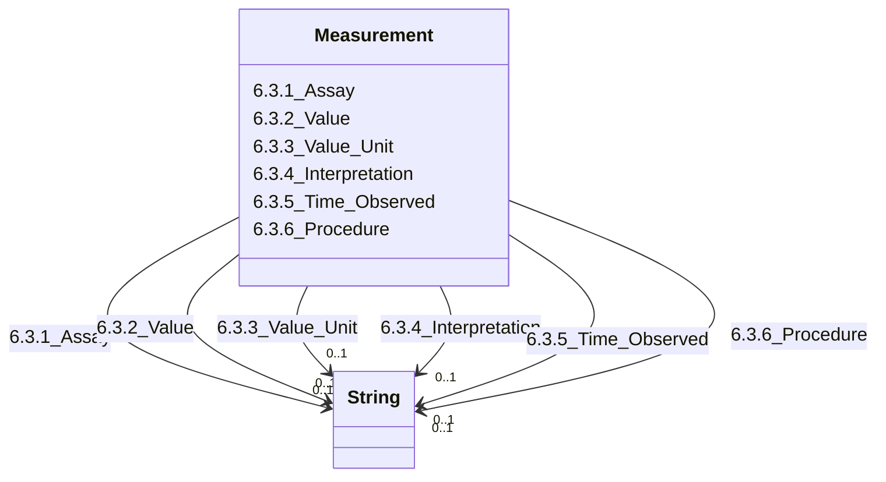

---
search:
  boost: 10.0
---

# Class: Measurement 


_6.3. Measurement_


<div data-search-exclude markdown="1">


URI: [rdcdm:Measurement](https://github.com/BIH-CEI/rd-cdm/Measurement)





<!-- no inheritance hierarchy -->

## Slots

| Name | Cardinality and Range | Description | Inheritance |
| ---  | --- | --- | --- |
| [6.3.1_Assay](6.3.1_Assay.md) | 0..1 <br/> [xsd:string](http://www.w3.org/2001/XMLSchema#string) | A class that describes the assay used to producethe measurement | direct |
| [6.3.2_Value](6.3.2_Value.md) | 0..1 <br/> [xsd:string](http://www.w3.org/2001/XMLSchema#string) | The result of the measurement | direct |
| [6.3.3_Value_Unit](6.3.3_Value_Unit.md) | 0..1 <br/> [xsd:string](http://www.w3.org/2001/XMLSchema#string) | The unit of the result's measurement | direct |
| [6.3.4_Interpretation](6.3.4_Interpretation.md) | 0..1 <br/> [xsd:string](http://www.w3.org/2001/XMLSchema#string) | The interpretation of the measurement (e | direct |
| [6.3.5_Time_Observed](6.3.5_Time_Observed.md) | 0..1 <br/> [xsd:string](http://www.w3.org/2001/XMLSchema#string) | Time at which the measurement was performed | direct |
| [6.3.6_Procedure](6.3.6_Procedure.md) | 0..1 <br/> [xsd:string](http://www.w3.org/2001/XMLSchema#string) | Clinical procedure performed to acquire the sample used for the measurement | direct |


## Identifier and Mapping Information


### Schema Source


* from schema: https://github.com/BIH-CEI/rd-cdm/linkml/rd_cdm_profile.yaml


## Mappings

| Mapping Type | Mapped Value |
| ---  | ---  |
| self | rdcdm:Measurement |
| native | rdcdm:Measurement |


## LinkML Source

<!-- TODO: investigate https://stackoverflow.com/questions/37606292/how-to-create-tabbed-code-blocks-in-mkdocs-or-sphinx -->

### Direct

<details>
```yaml
name: Measurement
description: 6.3. Measurement
from_schema: https://github.com/BIH-CEI/rd-cdm/linkml/rd_cdm_profile.yaml
slots:
- 6.3.1 Assay
- 6.3.2 Value
- 6.3.3 Value Unit
- 6.3.4 Interpretation
- 6.3.5 Time Observed
- 6.3.6 Procedure

```
</details>

### Induced

<details>
```yaml
name: Measurement
description: 6.3. Measurement
from_schema: https://github.com/BIH-CEI/rd-cdm/linkml/rd_cdm_profile.yaml
attributes:
  6.3.1 Assay:
    name: 6.3.1 Assay
    annotations:
      ordinal:
        tag: ordinal
        value: 6.3.1
      section:
        tag: section
        value: 6.3 Measurement
      data_type:
        tag: data_type
        value: Code
      data_specification:
        tag: data_specification
        value: OntologyClass (e.g. LOINC)
      fhir_expression:
        tag: fhir_expression
        value: Observation.code
      fhir_datatype:
        tag: fhir_datatype
        value: Code
      phenopacket_element:
        tag: phenopacket_element
        value: Measurement.assay
      phenopacket_datatype:
        tag: phenopacket_datatype
        value: OntologyClass
    description: A class that describes the assay used to producethe measurement.
    title: 6.3.1 Assay
    from_schema: https://github.com/BIH-CEI/rd-cdm/linkml/rd_cdm_profile.yaml
    rank: 1000
    slot_uri: NCIT:C60819
    alias: 6.3.1_Assay
    owner: Measurement
    domain_of:
    - Measurement
    range: string
  6.3.2 Value:
    name: 6.3.2 Value
    annotations:
      ordinal:
        tag: ordinal
        value: 6.3.2
      section:
        tag: section
        value: 6.3 Measurement
      data_type:
        tag: data_type
        value: Value
      data_specification:
        tag: data_specification
        value: float
      fhir_expression:
        tag: fhir_expression
        value: Observation.value[x]
      fhir_datatype:
        tag: fhir_datatype
        value: Quantity|integer
      phenopacket_element:
        tag: phenopacket_element
        value: Measurement.measurement_value
      phenopacket_datatype:
        tag: phenopacket_datatype
        value: Quantity[double/float]
    description: The result of the measurement.
    title: 6.3.2 Value
    from_schema: https://github.com/BIH-CEI/rd-cdm/linkml/rd_cdm_profile.yaml
    rank: 1000
    slot_uri: NCIT:C25712
    alias: 6.3.2_Value
    owner: Measurement
    domain_of:
    - Measurement
    range: string
  6.3.3 Value Unit:
    name: 6.3.3 Value Unit
    annotations:
      ordinal:
        tag: ordinal
        value: 6.3.3
      section:
        tag: section
        value: 6.3 Measurement
      data_type:
        tag: data_type
        value: Code
      data_specification:
        tag: data_specification
        value: UO
      fhir_expression:
        tag: fhir_expression
        value: Observation.value[x].unit
      fhir_datatype:
        tag: fhir_datatype
        value: CodeableConcept
      phenopacket_element:
        tag: phenopacket_element
        value: Measurement.measurement_value
      phenopacket_datatype:
        tag: phenopacket_datatype
        value: OntologyClass
    description: The unit of the result's measurement.
    title: 6.3.3 Value Unit
    from_schema: https://github.com/BIH-CEI/rd-cdm/linkml/rd_cdm_profile.yaml
    rank: 1000
    slot_uri: NCIT:C92571
    alias: 6.3.3_Value_Unit
    owner: Measurement
    domain_of:
    - Measurement
    range: string
  6.3.4 Interpretation:
    name: 6.3.4 Interpretation
    annotations:
      ordinal:
        tag: ordinal
        value: 6.3.4
      section:
        tag: section
        value: 6.3 Measurement
      data_type:
        tag: data_type
        value: Code
      data_specification:
        tag: data_specification
        value: NCIT
      fhir_expression:
        tag: fhir_expression
        value: Observation.interpretation
    description: 'The interpretation of the measurement (e.g.: Below/Within/Above
      age-related reference range, Absent/Low/Normal, or Positive/Negative).'
    title: 6.3.4 Interpretation
    from_schema: https://github.com/BIH-CEI/rd-cdm/linkml/rd_cdm_profile.yaml
    rank: 1000
    slot_uri: NCIT:C41255
    alias: 6.3.4_Interpretation
    owner: Measurement
    domain_of:
    - Measurement
    range: string
  6.3.5 Time Observed:
    name: 6.3.5 Time Observed
    annotations:
      ordinal:
        tag: ordinal
        value: 6.3.5
      section:
        tag: section
        value: 6.3 Measurement
      data_type:
        tag: data_type
        value: Date
      data_specification:
        tag: data_specification
        value: YYYY-MM-DD
      fhir_expression:
        tag: fhir_expression
        value: Observation.effectiveDateTime
      fhir_datatype:
        tag: fhir_datatype
        value: DateTime
      phenopacket_element:
        tag: phenopacket_element
        value: Measurement.time_observed
      phenopacket_datatype:
        tag: phenopacket_datatype
        value: TimeElement
    description: Time at which the measurement was performed.
    title: 6.3.5 Time Observed
    from_schema: https://github.com/BIH-CEI/rd-cdm/linkml/rd_cdm_profile.yaml
    rank: 1000
    slot_uri: NCIT:C82577
    alias: 6.3.5_Time_Observed
    owner: Measurement
    domain_of:
    - Measurement
    range: string
  6.3.6 Procedure:
    name: 6.3.6 Procedure
    annotations:
      ordinal:
        tag: ordinal
        value: 6.3.6
      section:
        tag: section
        value: 6.3 Measurement
      data_type:
        tag: data_type
        value: Code
      data_specification:
        tag: data_specification
        value: OntologyClass (e.g. NCIT, SNOMEDCT)
      fhir_expression:
        tag: fhir_expression
        value: Procedure.code
      fhir_datatype:
        tag: fhir_datatype
        value: Measurement.procedure
      phenopacket_element:
        tag: phenopacket_element
        value: Measurement.procedure
      phenopacket_datatype:
        tag: phenopacket_datatype
        value: Measurement.procedure
    description: Clinical procedure performed to acquire the sample used for the measurement.
    title: 6.3.6 Procedure
    from_schema: https://github.com/BIH-CEI/rd-cdm/linkml/rd_cdm_profile.yaml
    rank: 1000
    slot_uri: SNOMEDCT:122869004
    alias: 6.3.6_Procedure
    owner: Measurement
    domain_of:
    - Measurement
    range: string

```
</details></div>