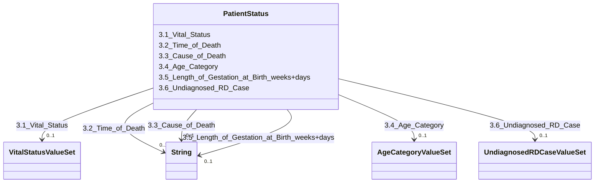

---
search:
  boost: 10.0
---

# Class: PatientStatus 


_3. Patient Status_


<div data-search-exclude markdown="1">


URI: [rdcdm:PatientStatus](https://github.com/BIH-CEI/rd-cdm/PatientStatus)





<!-- no inheritance hierarchy -->

## Slots

| Name | Cardinality and Range | Description | Inheritance |
| ---  | --- | --- | --- |
| [3.1_Vital_Status](3.1_Vital_Status.md) | 0..1 <br/> [VitalStatusValueSet](VitalStatusValueSet.md) | The individual’s general clinical status orvital status | direct |
| [3.2_Time_of_Death](3.2_Time_of_Death.md) | 0..1 <br/> [xsd:string](http://www.w3.org/2001/XMLSchema#string) | If deceased, the individual’s date of death | direct |
| [3.3_Cause_of_Death](3.3_Cause_of_Death.md) | 0..1 <br/> [xsd:string](http://www.w3.org/2001/XMLSchema#string) | If deceased, the individual’s primary cause of death | direct |
| [3.4_Age_Category](3.4_Age_Category.md) | 0..1 <br/> [AgeCategoryValueSet](AgeCategoryValueSet.md) | The individual's age category at thetime of data capture | direct |
| [3.5_Length_of_Gestation_at_Birth_weeks+days](3.5_Length_of_Gestation_at_Birth_weeks+days.md) | 0..1 <br/> [xsd:string](http://www.w3.org/2001/XMLSchema#string) | The duration of the pregnancy in weeks and days,formatted as XX+X (weeks+days... | direct |
| [3.6_Undiagnosed_RD_Case](3.6_Undiagnosed_RD_Case.md) | 0..1 <br/> [UndiagnosedRDCaseValueSet](UndiagnosedRDCaseValueSet.md) | Identifies cases where an RD diagnosis has notbeen established | direct |


## Identifier and Mapping Information


### Schema Source


* from schema: https://github.com/BIH-CEI/rd-cdm/linkml/rd_cdm_profile.yaml


## Mappings

| Mapping Type | Mapped Value |
| ---  | ---  |
| self | rdcdm:PatientStatus |
| native | rdcdm:PatientStatus |


## LinkML Source

<!-- TODO: investigate https://stackoverflow.com/questions/37606292/how-to-create-tabbed-code-blocks-in-mkdocs-or-sphinx -->

### Direct

<details>
```yaml
name: PatientStatus
description: 3. Patient Status
from_schema: https://github.com/BIH-CEI/rd-cdm/linkml/rd_cdm_profile.yaml
slots:
- 3.1 Vital Status
- 3.2 Time of Death
- 3.3 Cause of Death
- 3.4 Age Category
- 3.5 Length of Gestation at Birth weeks+days
- 3.6 Undiagnosed RD Case

```
</details>

### Induced

<details>
```yaml
name: PatientStatus
description: 3. Patient Status
from_schema: https://github.com/BIH-CEI/rd-cdm/linkml/rd_cdm_profile.yaml
attributes:
  3.1 Vital Status:
    name: 3.1 Vital Status
    annotations:
      ordinal:
        tag: ordinal
        value: '3.1'
      section:
        tag: section
        value: 3. Patient Status
      data_type:
        tag: data_type
        value: Code
      data_specification:
        tag: data_specification
        value: VSe, VSc
      fhir_expression:
        tag: fhir_expression
        value: Patient.deceased.deceasedBoolean|Observation.value
      fhir_datatype:
        tag: fhir_datatype
        value: Boolean|Code
      phenopacket_element:
        tag: phenopacket_element
        value: Individual.VitalStatus.status
      phenopacket_datatype:
        tag: phenopacket_datatype
        value: 'Value Set: VitalStatus.Status'
    description: The individual’s general clinical status orvital status.
    title: 3.1 Vital Status
    from_schema: https://github.com/BIH-CEI/rd-cdm/linkml/rd_cdm_profile.yaml
    rank: 1000
    slot_uri: SNOMEDCT:278844005
    alias: 3.1_Vital_Status
    owner: PatientStatus
    domain_of:
    - PatientStatus
    range: VitalStatusValueSet
  3.2 Time of Death:
    name: 3.2 Time of Death
    annotations:
      ordinal:
        tag: ordinal
        value: '3.2'
      section:
        tag: section
        value: 3. Patient Status
      data_type:
        tag: data_type
        value: Date
      data_specification:
        tag: data_specification
        value: YYYY, YYYY-MM, YYYY-MM-DD
      fhir_expression:
        tag: fhir_expression
        value: Patient.deceasedDateTime
      fhir_datatype:
        tag: fhir_datatype
        value: DateTime
      phenopacket_element:
        tag: phenopacket_element
        value: Individual.VitalStatus.time_of_death
      phenopacket_datatype:
        tag: phenopacket_datatype
        value: TimeElement
    description: If deceased, the individual’s date of death.
    title: 3.2 Time of Death
    from_schema: https://github.com/BIH-CEI/rd-cdm/linkml/rd_cdm_profile.yaml
    rank: 1000
    slot_uri: SNOMEDCT:398299004
    alias: 3.2_Time_of_Death
    owner: PatientStatus
    domain_of:
    - PatientStatus
    range: string
  3.3 Cause of Death:
    name: 3.3 Cause of Death
    annotations:
      ordinal:
        tag: ordinal
        value: '3.3'
      section:
        tag: section
        value: 3. Patient Status
      data_type:
        tag: data_type
        value: Code
      data_specification:
        tag: data_specification
        value: ICD-10CM
      fhir_expression:
        tag: fhir_expression
        value: Observation.value.coding.code
      fhir_datatype:
        tag: fhir_datatype
        value: Code|CodeableConcept
      phenopacket_element:
        tag: phenopacket_element
        value: Individual.VitalStatus.cause_of_death
      phenopacket_datatype:
        tag: phenopacket_datatype
        value: OntologyClass
    description: If deceased, the individual’s primary cause of death.
    title: 3.3 Cause of Death
    from_schema: https://github.com/BIH-CEI/rd-cdm/linkml/rd_cdm_profile.yaml
    rank: 1000
    slot_uri: SNOMEDCT:184305005
    alias: 3.3_Cause_of_Death
    owner: PatientStatus
    domain_of:
    - PatientStatus
    range: string
  3.4 Age Category:
    name: 3.4 Age Category
    annotations:
      ordinal:
        tag: ordinal
        value: '3.4'
      section:
        tag: section
        value: 3. Patient Status
      data_type:
        tag: data_type
        value: Code
      data_specification:
        tag: data_specification
        value: VSe
      fhir_expression:
        tag: fhir_expression
        value: Observation.value.coding.code
      fhir_datatype:
        tag: fhir_datatype
        value: CodableConcept
      phenopacket_element:
        tag: phenopacket_element
        value: Individual.time_at_last_encounter
      phenopacket_datatype:
        tag: phenopacket_datatype
        value: TimeElement
    description: The individual's age category at thetime of data capture.
    title: 3.4 Age Category
    from_schema: https://github.com/BIH-CEI/rd-cdm/linkml/rd_cdm_profile.yaml
    rank: 1000
    slot_uri: SNOMEDCT:105727008
    alias: 3.4_Age_Category
    owner: PatientStatus
    domain_of:
    - PatientStatus
    range: AgeCategoryValueSet
  3.5 Length of Gestation at Birth weeks+days:
    name: 3.5 Length of Gestation at Birth weeks+days
    annotations:
      ordinal:
        tag: ordinal
        value: '3.5'
      section:
        tag: section
        value: 3. Patient Status
      data_type:
        tag: data_type
        value: String
      data_specification:
        tag: data_specification
        value: XX+X
      fhir_expression:
        tag: fhir_expression
        value: Observation.component:weeks.valueQuantity|Observation.component:days.valueQuantity
      fhir_datatype:
        tag: fhir_datatype
        value: Quantity
    description: The duration of the pregnancy in weeks and days,formatted as XX+X
      (weeks+days).
    title: 3.5 Length of Gestation at Birth [weeks+days]
    from_schema: https://github.com/BIH-CEI/rd-cdm/linkml/rd_cdm_profile.yaml
    rank: 1000
    slot_uri: SNOMEDCT:412726003
    alias: 3.5_Length_of_Gestation_at_Birth_weeks+days
    owner: PatientStatus
    domain_of:
    - PatientStatus
    range: string
  3.6 Undiagnosed RD Case:
    name: 3.6 Undiagnosed RD Case
    annotations:
      ordinal:
        tag: ordinal
        value: '3.6'
      section:
        tag: section
        value: 3. Patient Status
      data_type:
        tag: data_type
        value: Code
      data_specification:
        tag: data_specification
        value: VSe
      fhir_expression:
        tag: fhir_expression
        value: (Condition.code)
      fhir_datatype:
        tag: fhir_datatype
        value: Code(e.g. ORDO:616874 - Rare disorderwithout a determined diagnosis
          afterfull investigation)
      phenopacket_element:
        tag: phenopacket_element
        value: (Disease.term)
      phenopacket_datatype:
        tag: phenopacket_datatype
        value: (OntologyClass (e.g. ORDO:616874 - Rare disorder without a determineddiagnosis
          after full investigation))
    description: Identifies cases where an RD diagnosis has notbeen established.
    title: 3.6 Undiagnosed RD Case
    from_schema: https://github.com/BIH-CEI/rd-cdm/linkml/rd_cdm_profile.yaml
    rank: 1000
    slot_uri: SNOMEDCT:723663001
    alias: 3.6_Undiagnosed_RD_Case
    owner: PatientStatus
    domain_of:
    - PatientStatus
    range: UndiagnosedRDCaseValueSet

```
</details></div>