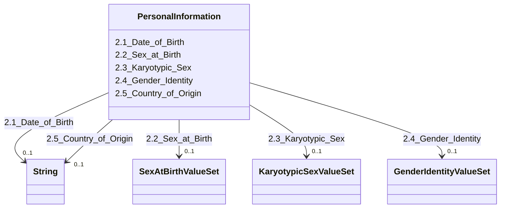

---
search:
  boost: 10.0
---

# Class: PersonalInformation 


_2. Personal Information_


<div data-search-exclude markdown="1">


URI: [rdcdm:PersonalInformation](https://github.com/BIH-CEI/rd-cdm/PersonalInformation)





<!-- no inheritance hierarchy -->

## Slots

| Name | Cardinality and Range | Description | Inheritance |
| ---  | --- | --- | --- |
| [2.1_Date_of_Birth](2.1_Date_of_Birth.md) | 0..1 <br/> [xsd:string](http://www.w3.org/2001/XMLSchema#string) | The individual's date of birth | direct |
| [2.2_Sex_at_Birth](2.2_Sex_at_Birth.md) | 0..1 <br/> [SexAtBirthValueSet](SexAtBirthValueSet.md) | The individual's sex that was assigned at birth | direct |
| [2.3_Karyotypic_Sex](2.3_Karyotypic_Sex.md) | 0..1 <br/> [KaryotypicSexValueSet](KaryotypicSexValueSet.md) | The chromosomal sex of an individual | direct |
| [2.4_Gender_Identity](2.4_Gender_Identity.md) | 0..1 <br/> [GenderIdentityValueSet](GenderIdentityValueSet.md) | The self-assigned gender of the individual | direct |
| [2.5_Country_of_Origin](2.5_Country_of_Origin.md) | 0..1 <br/> [xsd:string](http://www.w3.org/2001/XMLSchema#string) | A person’s descent or lineage, from a person or from a population | direct |


## Identifier and Mapping Information


### Schema Source


* from schema: https://github.com/BIH-CEI/rd-cdm/linkml/rd_cdm_profile.yaml


## Mappings

| Mapping Type | Mapped Value |
| ---  | ---  |
| self | rdcdm:PersonalInformation |
| native | rdcdm:PersonalInformation |


## LinkML Source

<!-- TODO: investigate https://stackoverflow.com/questions/37606292/how-to-create-tabbed-code-blocks-in-mkdocs-or-sphinx -->

### Direct

<details>
```yaml
name: PersonalInformation
description: 2. Personal Information
from_schema: https://github.com/BIH-CEI/rd-cdm/linkml/rd_cdm_profile.yaml
slots:
- 2.1 Date of Birth
- 2.2 Sex at Birth
- 2.3 Karyotypic Sex
- 2.4 Gender Identity
- 2.5 Country of Origin

```
</details>

### Induced

<details>
```yaml
name: PersonalInformation
description: 2. Personal Information
from_schema: https://github.com/BIH-CEI/rd-cdm/linkml/rd_cdm_profile.yaml
attributes:
  2.1 Date of Birth:
    name: 2.1 Date of Birth
    annotations:
      ordinal:
        tag: ordinal
        value: '2.1'
      section:
        tag: section
        value: 2. Personal Information
      data_type:
        tag: data_type
        value: Date
      data_specification:
        tag: data_specification
        value: YYYY, YYYY-MM, YYYY-MM-DD
      fhir_expression:
        tag: fhir_expression
        value: Patient.birthDate
      phenopacket_element:
        tag: phenopacket_element
        value: Individual.date_of_birth
      phenopacket_datatype:
        tag: phenopacket_datatype
        value: TimeElement
    description: The individual's date of birth.
    title: 2.1 Date of Birth
    from_schema: https://github.com/BIH-CEI/rd-cdm/linkml/rd_cdm_profile.yaml
    rank: 1000
    slot_uri: SNOMEDCT:184099003
    alias: 2.1_Date_of_Birth
    owner: PersonalInformation
    domain_of:
    - PersonalInformation
    range: string
  2.2 Sex at Birth:
    name: 2.2 Sex at Birth
    annotations:
      ordinal:
        tag: ordinal
        value: '2.2'
      section:
        tag: section
        value: 2. Personal Information
      data_type:
        tag: data_type
        value: Code
      data_specification:
        tag: data_specification
        value: VSe, VSc
      fhir_expression:
        tag: fhir_expression
        value: Patient.extension:individual-recordedSexOrGender
      fhir_datatype:
        tag: fhir_datatype
        value: Recorded Sex Or Gender Type
      phenopacket_element:
        tag: phenopacket_element
        value: Individual.sex
      phenopacket_datatype:
        tag: phenopacket_datatype
        value: Sex
    description: The individual's sex that was assigned at birth.
    title: 2.2 Sex at Birth
    from_schema: https://github.com/BIH-CEI/rd-cdm/linkml/rd_cdm_profile.yaml
    rank: 1000
    slot_uri: LOINC:76689-9
    alias: 2.2_Sex_at_Birth
    owner: PersonalInformation
    domain_of:
    - PersonalInformation
    range: SexAtBirthValueSet
  2.3 Karyotypic Sex:
    name: 2.3 Karyotypic Sex
    annotations:
      ordinal:
        tag: ordinal
        value: '2.3'
      section:
        tag: section
        value: 2. Personal Information
      data_type:
        tag: data_type
        value: Code
      data_specification:
        tag: data_specification
        value: VSc
      fhir_expression:
        tag: fhir_expression
        value: Observation.value
      phenopacket_element:
        tag: phenopacket_element
        value: Individual.karyotypic_sex
      phenopacket_datatype:
        tag: phenopacket_datatype
        value: Karyotypic Sex
    description: The chromosomal sex of an individual.
    title: 2.3 Karyotypic Sex
    from_schema: https://github.com/BIH-CEI/rd-cdm/linkml/rd_cdm_profile.yaml
    rank: 1000
    slot_uri: SNOMEDCT:1296886006
    alias: 2.3_Karyotypic_Sex
    owner: PersonalInformation
    domain_of:
    - PersonalInformation
    range: KaryotypicSexValueSet
  2.4 Gender Identity:
    name: 2.4 Gender Identity
    annotations:
      ordinal:
        tag: ordinal
        value: '2.4'
      section:
        tag: section
        value: 2. Personal Information
      data_type:
        tag: data_type
        value: Code
      data_specification:
        tag: data_specification
        value: VSe, VSc
      fhir_expression:
        tag: fhir_expression
        value: Patient.extension:individual-genderIdentity
      fhir_datatype:
        tag: fhir_datatype
        value: Gender Identity
      phenopacket_element:
        tag: phenopacket_element
        value: Individual.gender
      phenopacket_datatype:
        tag: phenopacket_datatype
        value: OntologyClass
    description: The self-assigned gender of the individual.
    title: 2.4 Gender Identity
    from_schema: https://github.com/BIH-CEI/rd-cdm/linkml/rd_cdm_profile.yaml
    rank: 1000
    slot_uri: SNOMEDCT:263495000
    alias: 2.4_Gender_Identity
    owner: PersonalInformation
    domain_of:
    - PersonalInformation
    range: GenderIdentityValueSet
  2.5 Country of Origin:
    name: 2.5 Country of Origin
    annotations:
      ordinal:
        tag: ordinal
        value: '2.5'
      section:
        tag: section
        value: 2. Personal Information
      data_type:
        tag: data_type
        value: Code
      data_specification:
        tag: data_specification
        value: ISO 3166-1 (2- or 3-letter country code), ISO 3166-2 (country subdivision)
      fhir_expression:
        tag: fhir_expression
        value: Patient.extension:patient-birthPlace
      fhir_datatype:
        tag: fhir_datatype
        value: 'DataType: Address'
    description: A person’s descent or lineage, from a person or from a population.
      Provide a 2- or 3-letter code from ISO 3166-1 if only a country is given; use
      ISO 3166-2 for a country subdivision. Aligned with the GDI equivalent element.
    title: 2.5 Country of Origin
    from_schema: https://github.com/BIH-CEI/rd-cdm/linkml/rd_cdm_profile.yaml
    rank: 1000
    slot_uri: CustomCode:country_of_origin
    alias: 2.5_Country_of_Origin
    owner: PersonalInformation
    domain_of:
    - PersonalInformation
    range: string

```
</details></div>