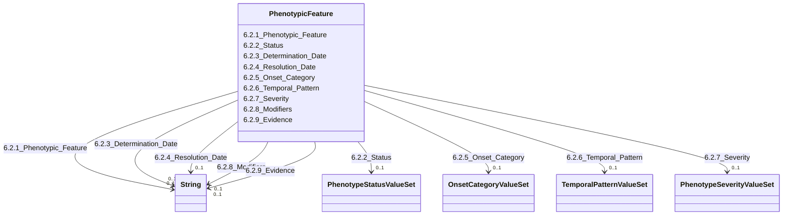

---
search:
  boost: 10.0
---

# Class: PhenotypicFeature 


_6.2. Phenotypic Feature_


<div data-search-exclude markdown="1">


URI: [rdcdm:PhenotypicFeature](https://github.com/BIH-CEI/rd-cdm/PhenotypicFeature)





<!-- no inheritance hierarchy -->

## Slots

| Name | Cardinality and Range | Description | Inheritance |
| ---  | --- | --- | --- |
| [6.2.1_Phenotypic_Feature](6.2.1_Phenotypic_Feature.md) | 0..1 <br/> [xsd:string](http://www.w3.org/2001/XMLSchema#string) | An observed physical and clinical characteristicencoded with HPO | direct |
| [6.2.2_Status](6.2.2_Status.md) | 0..1 <br/> [PhenotypeStatusValueSet](PhenotypeStatusValueSet.md) | The current status of the phenotypic feature, indicating whether it is confir... | direct |
| [6.2.3_Determination_Date](6.2.3_Determination_Date.md) | 0..1 <br/> [xsd:string](http://www.w3.org/2001/XMLSchema#string) | The date on which the phenotypic feature was observed or recorded | direct |
| [6.2.4_Resolution_Date](6.2.4_Resolution_Date.md) | 0..1 <br/> [xsd:string](http://www.w3.org/2001/XMLSchema#string) | Time at which the feature resolved or abated | direct |
| [6.2.5_Onset_Category](6.2.5_Onset_Category.md) | 0..1 <br/> [OnsetCategoryValueSet](OnsetCategoryValueSet.md) | Time at which the feature was first observed within  HPO onset categories | direct |
| [6.2.6_Temporal_Pattern](6.2.6_Temporal_Pattern.md) | 0..1 <br/> [TemporalPatternValueSet](TemporalPatternValueSet.md) | The speed at which disease manifestations appear and develop | direct |
| [6.2.7_Severity](6.2.7_Severity.md) | 0..1 <br/> [PhenotypeSeverityValueSet](PhenotypeSeverityValueSet.md) | A description of the severity of the feature | direct |
| [6.2.8_Modifiers](6.2.8_Modifiers.md) | 0..1 <br/> [xsd:string](http://www.w3.org/2001/XMLSchema#string) | Any number of additional modifiers describing a specific phenotypic feature f... | direct |
| [6.2.9_Evidence](6.2.9_Evidence.md) | 0..1 <br/> [xsd:string](http://www.w3.org/2001/XMLSchema#string) | The evidence for an assertion of the observation of a type defined within the... | direct |


## Identifier and Mapping Information


### Schema Source


* from schema: https://github.com/BIH-CEI/rd-cdm/linkml/rd_cdm_profile.yaml


## Mappings

| Mapping Type | Mapped Value |
| ---  | ---  |
| self | rdcdm:PhenotypicFeature |
| native | rdcdm:PhenotypicFeature |


## LinkML Source

<!-- TODO: investigate https://stackoverflow.com/questions/37606292/how-to-create-tabbed-code-blocks-in-mkdocs-or-sphinx -->

### Direct

<details>
```yaml
name: PhenotypicFeature
description: 6.2. Phenotypic Feature
from_schema: https://github.com/BIH-CEI/rd-cdm/linkml/rd_cdm_profile.yaml
slots:
- 6.2.1 Phenotypic Feature
- 6.2.2 Status
- 6.2.3 Determination Date
- 6.2.4 Resolution Date
- 6.2.5 Onset Category
- 6.2.6 Temporal Pattern
- 6.2.7 Severity
- 6.2.8 Modifiers
- 6.2.9 Evidence

```
</details>

### Induced

<details>
```yaml
name: PhenotypicFeature
description: 6.2. Phenotypic Feature
from_schema: https://github.com/BIH-CEI/rd-cdm/linkml/rd_cdm_profile.yaml
attributes:
  6.2.1 Phenotypic Feature:
    name: 6.2.1 Phenotypic Feature
    annotations:
      ordinal:
        tag: ordinal
        value: 6.2.1
      section:
        tag: section
        value: 6.2 Phenotypic Feature
      data_type:
        tag: data_type
        value: Code
      data_specification:
        tag: data_specification
        value: HPO
      fhir_expression:
        tag: fhir_expression
        value: Observation.code
      fhir_datatype:
        tag: fhir_datatype
        value: Code
      phenopacket_element:
        tag: phenopacket_element
        value: PhenotypicFeature.type
      phenopacket_datatype:
        tag: phenopacket_datatype
        value: OntologyClass
    description: An observed physical and clinical characteristicencoded with HPO.
    title: 6.2.1 Phenotypic Feature
    from_schema: https://github.com/BIH-CEI/rd-cdm/linkml/rd_cdm_profile.yaml
    rank: 1000
    slot_uri: SNOMEDCT:8116006
    alias: 6.2.1_Phenotypic_Feature
    owner: PhenotypicFeature
    domain_of:
    - PhenotypicFeature
    range: string
  6.2.2 Status:
    name: 6.2.2 Status
    annotations:
      ordinal:
        tag: ordinal
        value: 6.2.2
      section:
        tag: section
        value: 6.2 Phenotypic Feature
      data_type:
        tag: data_type
        value: Code
      data_specification:
        tag: data_specification
        value: VSe, VSc
      fhir_expression:
        tag: fhir_expression
        value: Observation.status
      fhir_datatype:
        tag: fhir_datatype
        value: 'ValueSet: ObservationStatus'
      phenopacket_element:
        tag: phenopacket_element
        value: PhenotypicFeature.excluded
      phenopacket_datatype:
        tag: phenopacket_datatype
        value: boolean
    description: The current status of the phenotypic feature, indicating whether
      it is confirmed or refuted.
    title: 6.2.2 Status
    from_schema: https://github.com/BIH-CEI/rd-cdm/linkml/rd_cdm_profile.yaml
    rank: 1000
    slot_uri: SNOMEDCT:363778006
    alias: 6.2.2_Status
    owner: PhenotypicFeature
    domain_of:
    - PhenotypicFeature
    range: PhenotypeStatusValueSet
  6.2.3 Determination Date:
    name: 6.2.3 Determination Date
    annotations:
      ordinal:
        tag: ordinal
        value: 6.2.3
      section:
        tag: section
        value: 6.2 Phenotypic Feature
      data_type:
        tag: data_type
        value: Date
      data_specification:
        tag: data_specification
        value: YYYY-MM-DD
      fhir_expression:
        tag: fhir_expression
        value: Observation.effectiveDateTime
      fhir_datatype:
        tag: fhir_datatype
        value: DateTime
      phenopacket_element:
        tag: phenopacket_element
        value: PhenotypicFeature.onset
      phenopacket_datatype:
        tag: phenopacket_datatype
        value: TimeElement
      element_code:
        tag: element_code
        value: SNOMEDCT:439272007:704321009=363778006
    description: The date on which the phenotypic feature was observed or recorded.
      We recommend capturing the time acharacteristic was observed.
    title: 6.2.3 Determination Date
    from_schema: https://github.com/BIH-CEI/rd-cdm/linkml/rd_cdm_profile.yaml
    rank: 1000
    alias: 6.2.3_Determination_Date
    owner: PhenotypicFeature
    domain_of:
    - PhenotypicFeature
    range: string
  6.2.4 Resolution Date:
    name: 6.2.4 Resolution Date
    annotations:
      ordinal:
        tag: ordinal
        value: 6.2.4
      section:
        tag: section
        value: 6.2 Phenotypic Feature
      data_type:
        tag: data_type
        value: Date
      data_specification:
        tag: data_specification
        value: YYYY-MM-DD
      fhir_expression:
        tag: fhir_expression
        value: Observation.effectiveDateTime
      fhir_datatype:
        tag: fhir_datatype
        value: DateTime
      phenopacket_element:
        tag: phenopacket_element
        value: PhenotypicFeature.resolution
      phenopacket_datatype:
        tag: phenopacket_datatype
        value: TimeElement
    description: Time at which the feature resolved or abated.
    title: 6.2.4 Resolution Date
    from_schema: https://github.com/BIH-CEI/rd-cdm/linkml/rd_cdm_profile.yaml
    rank: 1000
    slot_uri: HP:0034382
    alias: 6.2.4_Resolution_Date
    owner: PhenotypicFeature
    domain_of:
    - PhenotypicFeature
    range: string
  6.2.5 Onset Category:
    name: 6.2.5 Onset Category
    annotations:
      ordinal:
        tag: ordinal
        value: 6.2.5
      section:
        tag: section
        value: 6.2 Phenotypic Feature
      data_type:
        tag: data_type
        value: Code
      data_specification:
        tag: data_specification
        value: VSe, VSc
      fhir_expression:
        tag: fhir_expression
        value: Observation.category
      fhir_datatype:
        tag: fhir_datatype
        value: CodeableConcept
      phenopacket_element:
        tag: phenopacket_element
        value: PhenotypicFeature.onset
      phenopacket_datatype:
        tag: phenopacket_datatype
        value: OntologyClass
    description: Time at which the feature was first observed within  HPO onset categories.
    title: 6.2.5 Onset Category
    from_schema: https://github.com/BIH-CEI/rd-cdm/linkml/rd_cdm_profile.yaml
    rank: 1000
    slot_uri: HP:0003674
    alias: 6.2.5_Onset_Category
    owner: PhenotypicFeature
    domain_of:
    - PhenotypicFeature
    range: OnsetCategoryValueSet
  6.2.6 Temporal Pattern:
    name: 6.2.6 Temporal Pattern
    annotations:
      ordinal:
        tag: ordinal
        value: 6.2.6
      section:
        tag: section
        value: 6.2 Phenotypic Feature
      data_type:
        tag: data_type
        value: Code
      data_specification:
        tag: data_specification
        value: VSe, VSc
      fhir_expression:
        tag: fhir_expression
        value: Observation.interpretation
      fhir_datatype:
        tag: fhir_datatype
        value: CodeableConcept
      phenopacket_element:
        tag: phenopacket_element
        value: PhenotypicFeature.modifiers
      phenopacket_datatype:
        tag: phenopacket_datatype
        value: OntologyClass
    description: The speed at which disease manifestations appear and develop.
    title: 6.2.6 Temporal Pattern
    from_schema: https://github.com/BIH-CEI/rd-cdm/linkml/rd_cdm_profile.yaml
    rank: 1000
    slot_uri: HP:0011008
    alias: 6.2.6_Temporal_Pattern
    owner: PhenotypicFeature
    domain_of:
    - PhenotypicFeature
    range: TemporalPatternValueSet
  6.2.7 Severity:
    name: 6.2.7 Severity
    annotations:
      ordinal:
        tag: ordinal
        value: 6.2.7
      section:
        tag: section
        value: 6.2 Phenotypic Feature
      data_type:
        tag: data_type
        value: Code
      data_specification:
        tag: data_specification
        value: VSe, VSc
      fhir_expression:
        tag: fhir_expression
        value: Observation.interpretation
      fhir_datatype:
        tag: fhir_datatype
        value: CodeableConcept
      phenopacket_element:
        tag: phenopacket_element
        value: PhenotypicFeature.severity
      phenopacket_datatype:
        tag: phenopacket_datatype
        value: OntologyClass
    description: A description of the severity of the feature.
    title: 6.2.7 Severity
    from_schema: https://github.com/BIH-CEI/rd-cdm/linkml/rd_cdm_profile.yaml
    rank: 1000
    slot_uri: HP:0012824
    alias: 6.2.7_Severity
    owner: PhenotypicFeature
    domain_of:
    - PhenotypicFeature
    range: PhenotypeSeverityValueSet
  6.2.8 Modifiers:
    name: 6.2.8 Modifiers
    annotations:
      ordinal:
        tag: ordinal
        value: 6.2.8
      section:
        tag: section
        value: 6.2 Phenotypic Feature
      data_type:
        tag: data_type
        value: Code
      data_specification:
        tag: data_specification
        value: OntologyClass (HPO, NCBITAXON, SCT)
      fhir_expression:
        tag: fhir_expression
        value: 'Suggested: Observation.extension'
      fhir_datatype:
        tag: fhir_datatype
        value: CodeableConcept
      phenopacket_element:
        tag: phenopacket_element
        value: PhenotypicFeature.modifiers
      phenopacket_datatype:
        tag: phenopacket_datatype
        value: list of OntologyClass
    description: Any number of additional modifiers describing a specific phenotypic
      feature further, such as severity (HP:0012824), clinical modifiers (HP:0012823),
      or linking causative infectious agents using the NCBITAXON Ontology.
    title: 6.2.8 Modifiers
    from_schema: https://github.com/BIH-CEI/rd-cdm/linkml/rd_cdm_profile.yaml
    rank: 1000
    slot_uri: GA4GH:phenotypicfeature.modifier
    alias: 6.2.8_Modifiers
    owner: PhenotypicFeature
    domain_of:
    - PhenotypicFeature
    range: string
  6.2.9 Evidence:
    name: 6.2.9 Evidence
    annotations:
      ordinal:
        tag: ordinal
        value: 6.2.9
      section:
        tag: section
        value: 6.2 Phenotypic Feature
      data_type:
        tag: data_type
        value: Code
      data_specification:
        tag: data_specification
        value: ECO
      fhir_expression:
        tag: fhir_expression
        value: Observation.method
      fhir_datatype:
        tag: fhir_datatype
        value: CodeableConcept
      phenopacket_element:
        tag: phenopacket_element
        value: PhenotypicFeature.evidence
      phenopacket_datatype:
        tag: phenopacket_datatype
        value: OntologyClass
    description: The evidence for an assertion of the observation of a type defined
      within the Evidence & Conclusion Ontology (ECO).
    title: 6.2.9 Evidence
    from_schema: https://github.com/BIH-CEI/rd-cdm/linkml/rd_cdm_profile.yaml
    rank: 1000
    slot_uri: GA4GH:phenotypicfeature.evidence
    alias: 6.2.9_Evidence
    owner: PhenotypicFeature
    domain_of:
    - PhenotypicFeature
    range: string

```
</details></div>